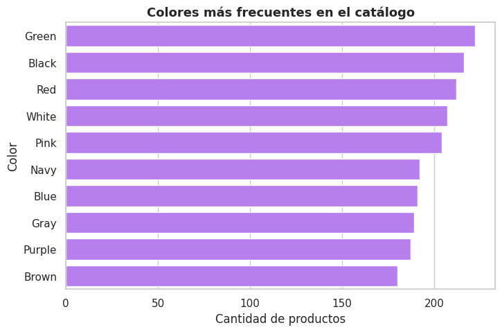
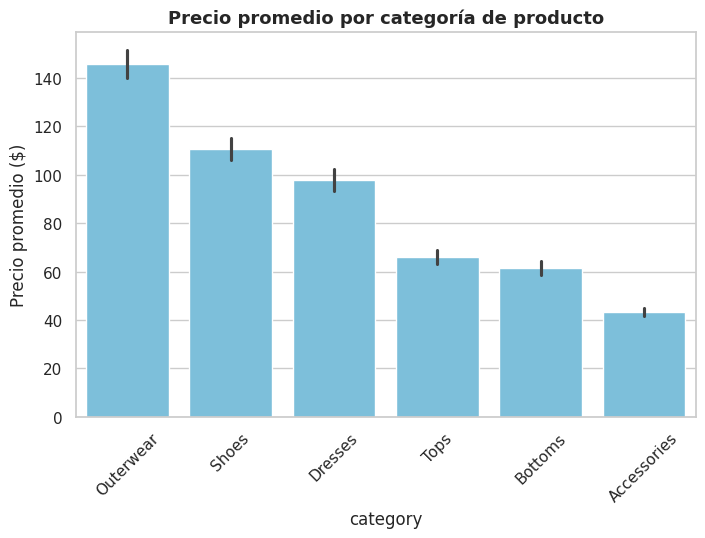
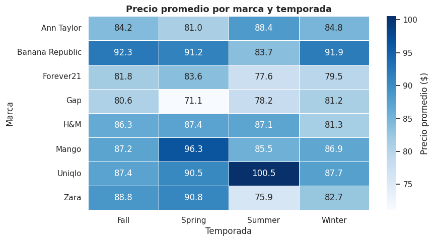

## Contexto
El dataset *Retail Fashion Boutique Data Analytics (2025)* recopila información sobre productos de moda minorista, incluyendo variables como marca, categoría, color, temporada, precio y disponibilidad.  
Su formato en **JSON** permitió trabajar con una estructura jerárquica más compleja que las prácticas anteriores, representando un escenario real de análisis en entornos de retail y comercio electrónico.

El objetivo general fue aplicar técnicas de **análisis exploratorio de datos (EDA)** para detectar patrones en precios, distribución de productos y estrategias de marca, integrando limpieza, visualización y reflexión analítica.

---

## Objetivos
- Explorar la estructura jerárquica del dataset en formato JSON.  
- Analizar el comportamiento de precios por categoría y temporada.  
- Comparar el posicionamiento de distintas marcas según volumen de productos y precios promedio.  
- Identificar colores predominantes y su relación con la oferta general.  
- Documentar un flujo reproducible de análisis y visualización.

---

## Actividades
- Lectura del dataset utilizando la librería **Pandas** con `pd.read_json()`.  
- Análisis exploratorio inicial con `info()`, `describe()` y conteo de valores nulos.  
- Limpieza de datos: conversión de tipos, eliminación de duplicados y estandarización de nombres de marca.  
- Generación de visualizaciones con **Matplotlib** y **Seaborn**.  
- Interpretación de patrones y elaboración de insights en contexto comercial.

---

## Desarrollo

El trabajo se llevó a cabo en **Google Colab**, garantizando un entorno reproducible e integrado con GitHub.  
A continuación, se presentan los pasos principales del proceso:

### Carga y exploración del dataset
El dataset fue descargado automáticamente desde **KaggleHub**, verificando su estructura y contenido.  
Se trabajó con la versión JSON, dado que conserva la jerarquía de atributos por producto.  
Las verificaciones iniciales incluyeron:
- Revisión de la estructura con `df.columns` y `df.info()`.  
- Control de valores nulos (`df.isna().sum()`), que resultaron mínimos.  
- Conteo de categorías y marcas únicas (`df['brand'].nunique()`, `df['category'].nunique()`).

---

## Evidencias

### Colores más frecuentes en el catálogo  
  
Se observa predominio de tonos neutros (negro, blanco, gris) junto con colores vivos como rosa y verde, evidenciando una oferta equilibrada entre sobriedad y estilo moderno.

---

### Precio promedio por categoría  
  
Las categorías de **Outerwear** y **Footwear** presentan precios medios más altos, reflejando su rol como ítems de valor dentro del catálogo.

---

### Precio promedio por marca y temporada  
  
El mapa de calor muestra diferencias marcadas: **Mango** y **Uniqlo** mantienen precios superiores durante *Spring/Summer*, sugiriendo una estrategia de premium pricing estacional.

---

### Comparación de marcas: volumen vs precio promedio  
  
Se destaca **Zara** como la marca con mayor volumen de productos, mientras que **Banana Republic** y **Uniqlo** mantienen precios promedio más altos con menor cantidad de artículos.

---

## Insights clave
1. El dataset presenta estructura limpia y coherente para su análisis.  
2. Las categorías de prendas exteriores concentran los precios más altos.  
3. Existen diferencias claras entre marcas, tanto en volumen como en política de precios.  
4. Los colores neutros dominan, pero los tonos vivos aportan variedad en las líneas de temporada.  
5. Se observa un patrón estacional en el pricing, con picos en primavera y verano.

---

## Reflexión
Esta práctica complementaria permitió aplicar un flujo de EDA sobre un dataset más complejo y cercano al entorno real del comercio minorista.  
El formato **JSON** implicó un desafío adicional al requerir adaptación del proceso de lectura y limpieza.  

El análisis fortaleció competencias en visualización, interpretación de datos comerciales y comunicación de hallazgos reproducibles, combinando el enfoque técnico con una mirada estratégica sobre la dinámica de precios y marcas.  

Además, sirvió como cierre integrador de la UT1, mostrando la importancia de la consistencia de datos y la claridad visual en contextos empresariales reales.

---

## Notebook en Google Colab
📓El notebook completo con el desarrollo de esta práctica puede consultarse en el siguiente enlace:

[🔗 Abrir en Google Colab](https://colab.research.google.com/github/Agustina-Esquibel/Ingenieria-datos/blob/main/docs/UT1/extraUT1/ExtraUT1.ipynb)

---

## Referencias
- Kaggle Dataset: [Retail Fashion Boutique Data Analytics 2025](https://www.kaggle.com/datasets/pratyushpuri/retail-fashion-boutique-data-sales-analytics-2025)  
- Documentación de Pandas y Seaborn.  

---

## Navegación
⬅️ [Volver a Unidad Temática 1](../main.md)  
📓 [Índice del Portafolio](../../portfolio/index.md)
