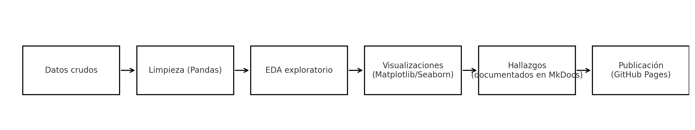

# Unidad Temática 1 (UT1) – EDA & Fuentes

En esta primera unidad se trabajaron los fundamentos de **análisis exploratorio de datos (EDA)** y la preparación de fuentes en distintos formatos.  
El objetivo fue aplicar técnicas básicas con Pandas, crear visualizaciones con Matplotlib/Seaborn y documentar hallazgos siguiendo buenas prácticas.

## Prácticas realizadas
- [**Explorando el Iris Dataset: patrones florales y variables predictivas**](practica1/main1.md)
*Análisis exploratorio de un dataset clásico para identificar relaciones y variables con potencial predictivo.*
- [Práctica 2: Configuración del portafolio en GitHub](practica2/main2.md)
- [Práctica 3: Dataset Netflix](practica3/main3.md)
- [Práctica 4: Dataset Taxis de Nueva York](practica4/main4.md)

## Reflexión de la unidad
- **Iris** permitió afianzar conceptos básicos de EDA y practicar correlaciones y visualizaciones rápidas.  
- **Configuración del portafolio** fue clave para organizar todo el flujo de trabajo en GitHub Pages y asegurar que la documentación sea clara y accesible desde el inicio.  
- **Netflix** enfrentó al desafío de limpiar datos reales con valores faltantes, aplicar filtros y generar visualizaciones que aporten insights concretos.  
- **Taxis NYC** consolidó el uso de *joins* y métricas temporales, lo que ayudó a comprender la importancia de integrar fuentes distintas para enriquecer un análisis.

En conjunto, la UT1  permitió pasar de un EDA introductorio a la integración de múltiples fuentes, conectando el análisis exploratorio con la organización de proyectos reproducibles.  
Este proceso me prepara para las siguientes unidades, donde espero profundizar en técnicas de modelado y análisis avanzado, aplicando lo aprendido sobre limpieza, visualización y documentación como base sólida.

## 🚀 Flujo de trabajo de UT1

Este esquema refleja cómo cada práctica aportó a un ciclo completo de trabajo,
desde la carga de datos hasta la comunicación de resultados reproducibles.

## Conclusión final de UT1
La UT1 me permitió integrar técnica y reflexión, consolidando un flujo reproducible de análisis de datos con limpieza, visualización y documentación clara. Estas bases me preparan para avanzar hacia análisis más complejos con mayor solidez metodológica.
