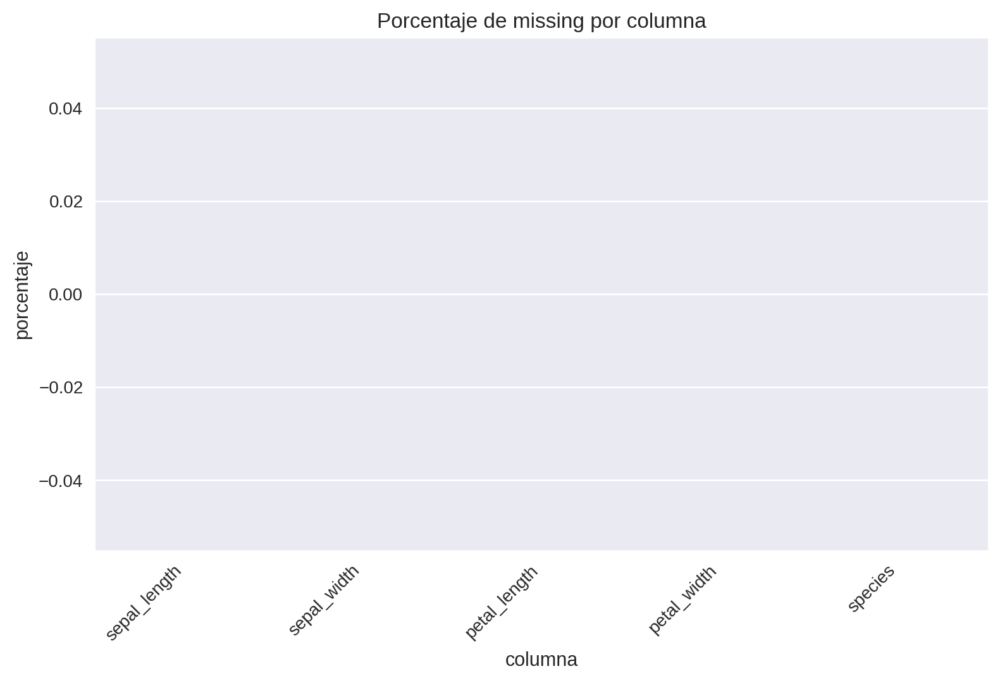
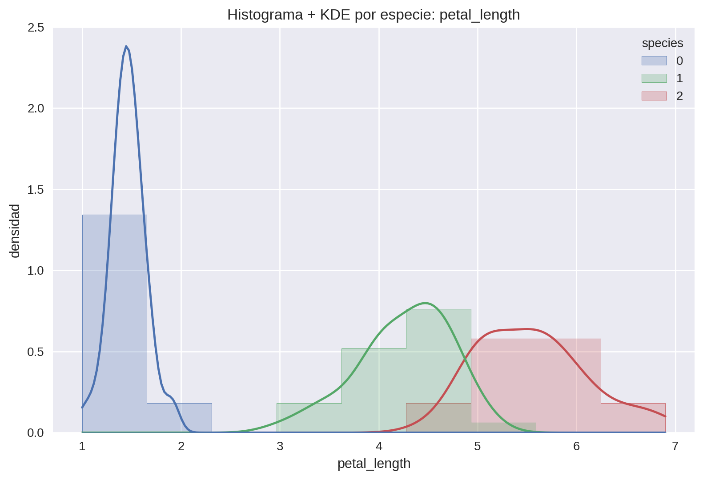
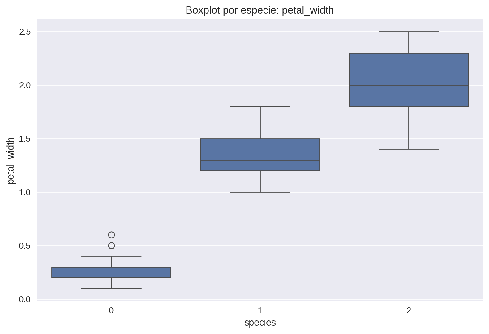

## Contexto
El Iris Dataset es uno de los conjuntos de datos más clásicos y utilizados en el análisis exploratorio y el aprendizaje automático. Contiene 150 observaciones correspondientes a tres especies de iris (Setosa, Versicolor y Virginica), con mediciones sobre la longitud y el ancho de los sépalos y pétalos. Por su estructura simple, balanceada y sin valores faltantes, resulta ideal para aplicar un flujo completo de EDA (Exploratory Data Analysis) y comprender cómo las variables numéricas pueden servir como predictoras en tareas de clasificación.

## Objetivos
- Explorar la estructura y balance del dataset.  
- Calcular estadísticas descriptivas e identificar correlaciones.
- Generar visualizaciones que revelen patrones entre las especies.  
- Documentar un flujo reproducible en Google Colab utilizando Pandas y Seaborn.  
- Reflexionar sobre las variables con mayor poder predictivo.  

## Actividades
- Configuración del entorno en **Google Colab** e instalación de librerías necesarias.  
- Carga de datos desde distintas fuentes (Seaborn, scikit-learn, Kaggle API, CSV manual).  
- Revisión inicial: dimensiones, tipos de datos, primeras filas y valores faltantes.  
- Construcción de un diccionario de datos.  
- Chequeo de duplicados e imbalance de clases.  
- Análisis descriptivo y correlaciones.  
- Redacción de insights accionables.  
- Documentación del flujo y guardado de resultados en directorios.  

## Desarrollo
El análisis se llevó a cabo en **Google Colab**, lo que permitió trabajar en un entorno reproducible y con la opción de guardar visualizaciones y reportes en Google Drive.  
Se inició creando un notebook en Python 3, instalando y verificando las versiones de *Pandas, Seaborn y Matplotlib*.  

### Carga y verificación de datos
Se exploraron distintas formas de cargar el dataset:  
- Con `seaborn.load_dataset("iris")`.  
- Desde la librería **scikit-learn** (`datasets.load_iris`).  
- A través de la **Kaggle API**.  
- Mediante lectura de un CSV local o desde una URL pública.  

Todas las opciones produjeron la misma estructura de datos, confirmando que la fuente no altera el contenido, aunque sí el formato de salida.  
Para el análisis principal se utilizó la carga desde **Seaborn**, por su simplicidad y consistencia.  

Los primeros chequeos (`df.shape`, `df.dtypes`, `df.head()`) confirmaron que:  
- El dataset contenía 150 registros y 5 columnas.  
- No había valores faltantes (`df.isna().sum() == 0`).  
- No existían registros duplicados.  
- Cada clase de la variable `species` tenía exactamente 50 registros, garantizando balance.  

### Análisis descriptivo
Con `df.describe()` se calcularon estadísticos básicos. Se observó que las variables de pétalos presentaban rangos más amplios y mayor poder discriminante que las de sépalos, sugiriendo que serían más útiles para clasificación.  

### Análisis de correlaciones
La matriz de correlación (`df.corr()`) mostró una relación positiva muy fuerte (~0.96) entre `petal_length` y `petal_width`.  
Este hallazgo sirvió para profundizar luego con visualizaciones específicas.  

### Documentación y reproducibilidad
Todos los resultados (estadísticos, diccionario de datos y visualizaciones) se guardaron en directorios específicos dentro del notebook.  
Este flujo organizado asegura trazabilidad y reproducibilidad, siguiendo buenas prácticas de ciencia de datos.

## Evidencias
### Diccionario de datos
| Variable        | Tipo    | Unidad | Descripción                 |
|-----------------|--------|--------|-----------------------------|
| sepal_length    | float  | cm     | Longitud del sépalo         |
| sepal_width     | float  | cm     | Ancho del sépalo            |
| petal_length    | float  | cm     | Longitud del pétalo         |
| petal_width     | float  | cm     | Ancho del pétalo            |
| species         | string | -      | Especie de la flor (*Setosa, Versicolor, Virginica*) |

#### Análisis de valores faltantes
El gráfico de valores faltantes confirma que el conjunto de datos se encuentra completo, sin registros nulos o vacíos.  
Esto garantiza la consistencia de las observaciones y evita la necesidad de aplicar técnicas de imputación o limpieza de datos adicionales.

### Matriz de Correlaciones
La matriz de correlaciones muestra las relaciones entre las variables numéricas.  
Se observa una correlación muy fuerte (~0.96) entre `petal_length` y `petal_width`, lo que sugiere que ambas aportan información similar y pueden funcionar como variables predictoras redundantes en un modelo de clasificación.

### Pairplot comparativo por especie 
El pairplot muestra cómo **Setosa** se separa claramente de las demás especies en variables de pétalos, mientras que **Versicolor** y **Virginica** presentan mayor solapamiento, lo que anticipa dificultades de clasificación lineal entre ambas.  

### Boxplot del largo de pétalo
El boxplot refleja que **Setosa** tiene pétalos consistentemente más pequeños, mientras que **Virginica** concentra los valores más altos, confirmando que la longitud y ancho de pétalos son las variables más discriminantes.  

#### Histograma del largo de pétalo
El histograma permite visualizar la distribución de `petal_length` por especie.  
*Setosa* presenta valores concentrados entre 1 y 2 cm, *Versicolor* entre 4 y 5 cm, y *Virginica* entre 5 y 6,5 cm.  
Las distribuciones no se superponen significativamente, lo que refuerza la utilidad de esta variable para distinguir especies.

#### Boxplot del ancho de pétalo
El análisis del ancho de pétalo complementa los resultados anteriores.  
Se observa nuevamente una separación marcada entre *Setosa* y las demás especies, mientras que *Versicolor* y *Virginica* mantienen valores parcialmente solapados.  
Esto sugiere que la combinación de largo y ancho de pétalo es adecuada para construir un modelo de clasificación con alto desempeño.

---
## Insights clave
1. **Setosa** se diferencia netamente de las otras dos especies en las medidas de pétalos.  
2. Existe una correlación de ~0.96 entre `petal_length` y `petal_width`.  
3. El dataset está perfectamente balanceado (50 registros por especie).  
4. **Versicolor** y **Virginica** muestran zonas de solapamiento que podrían dificultar la clasificación.  
5. Las variables de pétalos son más discriminantes que las de sépalos para separar especies.  

## Reflexión
Esta práctica permitió aplicar un flujo completo de análisis exploratorio: cargar datos, describirlos, visualizarlos y extraer insights.  
Los resultados mostraron la importancia de identificar variables discriminantes antes de aplicar algoritmos de clasificación.  

Un aprendizaje importante fue comprobar cómo distintas librerías ofrecen varias formas de cargar el mismo dataset. Esto refuerza la necesidad de documentar claramente la fuente utilizada, ya que la trazabilidad del origen de los datos es fundamental para la reproducibilidad de los proyectos.  

El ejercicio mostró la ventaja de documentar cada paso en un entorno reproducible (Colab + GitHub), reforzando la idea de que la calidad del análisis depende tanto de la limpieza del código como de la claridad en la comunicación de resultados.  

Un aspecto crítico es que, al tratarse de un dataset pequeño y balanceado, el análisis fue sencillo y directo. Sin embargo, esto también es una limitación: no refleja la complejidad de datos reales con outliers, ruido o desbalance severo. Este contraste lo convierte en un excelente punto de partida, pero también en un recordatorio de que los siguientes desafíos requerirán mayor profundidad analítica.  

## Notebook en Google Colab
📓 El notebook completo con el desarrollo de esta práctica puede consultarse en el siguiente enlace:  
[🔗 Abrir en Google Colab](https://colab.research.google.com/github/agustina-esquibel/Ingenieria-datos/blob/main/docs/UT1/practica1/practica1_agustina_esquibel.ipynb)

## Referencias
- [Iris Dataset (UCI)](https://archive.ics.uci.edu/dataset/53/iris)  
- [Iris Dataset (Kaggle)](https://www.kaggle.com/datasets/uciml/iris)  

## Navegación
⬅️ [Volver a Unidad Temática 1](../main.md)  
➡️ [Ir a Práctica 2 – Configuración del portfolio](../practica2/main2.md)  
📓 [Índice del Portafolio](../../portfolio/index.md)  
