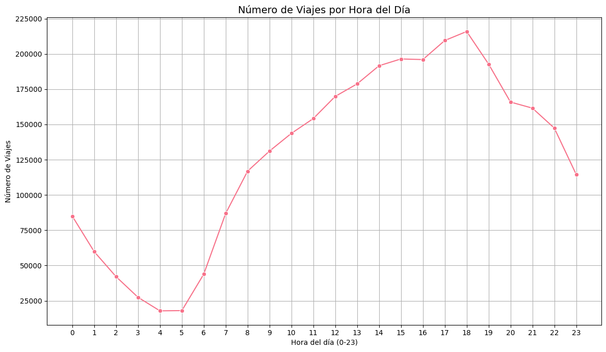
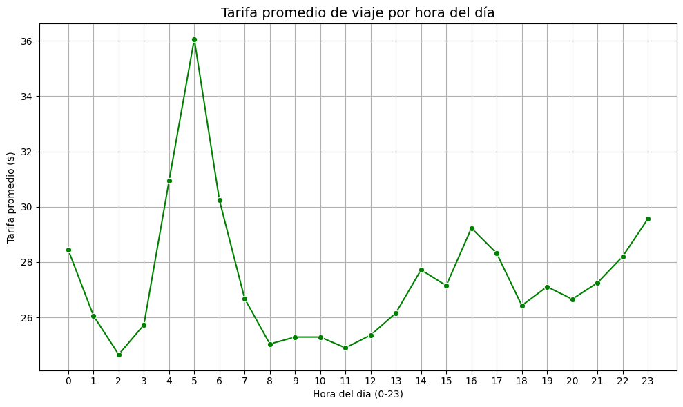
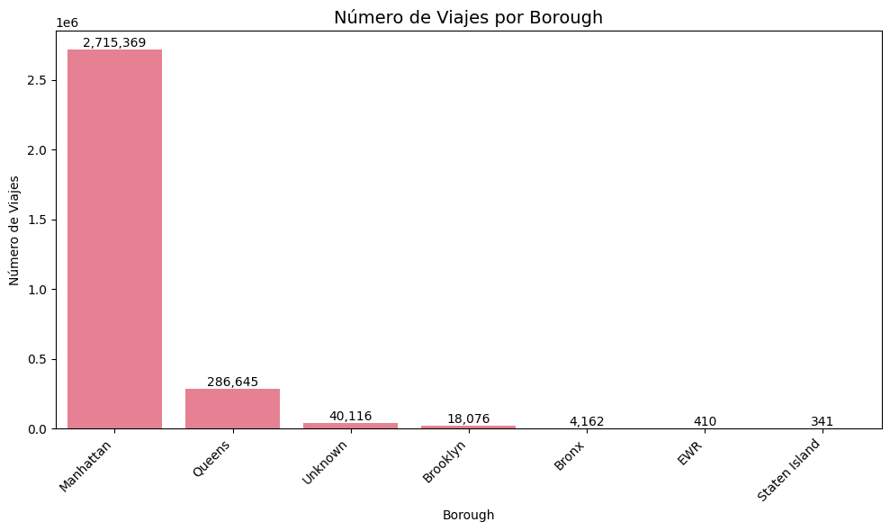
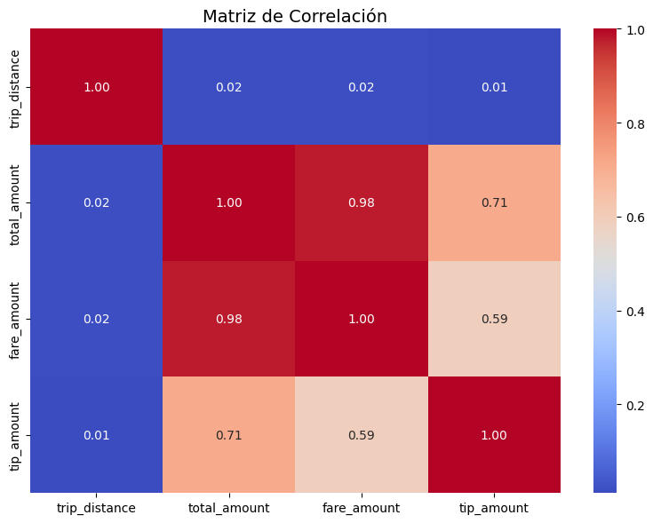

## Contexto
En esta práctica se integraron múltiples fuentes de datos del ecosistema de transporte de Nueva York —viajes, zonas y calendario de eventos— aplicando distintas estrategias de unión (*joins*)
El objetivo principal fue comprender cómo los distintos tipos de *joins* permiten enriquecer los datos y facilitar un análisis posterior más profundo.

## Objetivos
- Integrar datasets provenientes de diferentes formatos (CSV, Parquet, JSON).  
- Normalizar columnas y preparar los datos para *joins*.  
- Aplicar **LEFT JOIN** e **INNER JOIN** y analizar sus diferencias.  
- Comparar métricas entre días normales y días especiales.  
- Generar insights accionables a partir de datos integrados.  

## Actividades
1. Carga de datasets de viajes, zonas y calendario.  
2. Normalización de nombres de columnas y fechas.  
3. Aplicación de **LEFT JOIN** de viajes con zonas para asignar boroughs.  
4. Integración con calendario y creación de la variable `is_special_day`.  
5. Análisis comparativo de viajes en días normales vs días especiales.  
6. Cálculo de métricas clave: cantidad de viajes, distancias y tarifas.  
7. Reflexión crítica sobre la utilidad de los *joins* y la integración multifuente.  

## Desarrollo
El trabajo permitió poner en práctica las técnicas de unión de datasets en *pandas*.  
Se observó que el uso de *LEFT JOIN* garantiza mantener la totalidad de los registros originales, incluso si faltan coincidencias en la tabla de referencia. En cambio, *INNER JOIN* restringe el universo de análisis, priorizando solo las coincidencias exactas.  
La integración del contexto espacial (zonas) y temporal (días especiales) aportó una visión más completa que la obtenida con un dataset aislado. Esto permitió calcular métricas agregadas por *borough* y comparar la demanda de viajes según el tipo de día, destacando el impacto de eventos y feriados en el volumen de transporte.  
Además, se aplicaron cálculos de eficiencia y optimización de memoria para manejar grandes volúmenes de datos, reforzando la importancia de preparar correctamente las fuentes antes de ejecutar los *joins*

## Evidencias
## Visualizaciones complementarias

### 1. Número de viajes por hora del día
La distribución horaria evidencia una baja actividad entre las 03:00 y las 05:00, seguida por un aumento sostenido hacia las horas laborales y un máximo de demanda entre las 17:00 y las 19:00.

---

### 2. Tarifa promedio por hora del día
Se observa una variación horaria en las tarifas, con valores más altos en la madrugada (alrededor de las 04:00–05:00) y un segundo incremento al atardecer, coincidiendo con los picos de tránsito.

---

### 3. Número de viajes por *borough*
El análisis geográfico confirma la concentración de viajes en Manhattan, seguido por Queens. El resto de las zonas presenta volúmenes significativamente menores, lo que refleja la centralidad del distrito de Manhattan en la actividad del transporte urbano.

---

### 4. Matriz de correlación entre variables numéricas
La matriz de correlación muestra una relación muy alta entre `total_amount` y `fare_amount` (0.98), una correlación moderada entre `tip_amount` y `fare_amount`, y una baja asociación entre `trip_distance` y los montos, lo que sugiere que la tarifa total está más influida por recargos y componentes fijos que por la distancia recorrida.

---

### Conclusión general
Las visualizaciones refuerzan el análisis del dataset mediante una comprensión más clara de los patrones temporales, geográficos y económicos del sistema de transporte. En conjunto, aportan evidencia visual que respalda los resultados obtenidos en el pipeline de integración y análisis.

## Insights clave
1. El **LEFT JOIN** fue clave para no perder viajes sin correspondencia en zonas, preservando el universo completo de análisis.  
2. La integración con el calendario permitió detectar variaciones de demanda en días especiales, invisibles con un dataset aislado.  
3. Los boroughs presentan distribuciones desiguales de viajes, lo que sugiere patrones de movilidad distintos según la zona.  
4. La combinación de múltiples fuentes mejora la calidad de los indicadores (ej. métricas por borough y por tipo de día).  
5. La elección del tipo de *join* no es trivial: influye directamente en el alcance y la interpretación de los resultados.  

## Reflexión
Esta práctica refuerza la importancia de la **integración de datos** como paso previo a cualquier análisis serio.  
Trabajar con múltiples fuentes permitió construir indicadores más representativos y detectar patrones que no emergen con datasets aislados.  

El contraste entre **LEFT JOIN** e **INNER JOIN** mostró cómo una decisión técnica puede modificar los resultados: el primero conserva información completa aunque con nulos, mientras que el segundo es más restrictivo pero asegura consistencia.  

En conclusión, integrar datos y reflexionar críticamente sobre la estrategia de unión no solo mejora los resultados inmediatos, sino que sienta bases sólidas para análisis más avanzados en proyectos reales.  

## Notebook en Google Colab
📓 El notebook completo con el desarrollo de esta práctica puede consultarse en el siguiente enlace:  
[🔗 Abrir en Google Colab](https://colab.research.google.com/github/agustina-esquibel/Ingenieria-datos/blob/main/docs/UT1/practica4/Agustina_Esquibelpractico4final.ipynb)

## Referencias
- [NYC Taxi Dataset](https://www1.nyc.gov)  
- [NYC Taxi Zones](https://www1.nyc.gov)  
- [Documentación `pandas.merge`](https://pandas.pydata.org/docs/reference/api/pandas.DataFrame.merge.html)  

## Navegación
⬅️ [Volver a Unidad Temática 1](../main.md)  
📓 [Índice del Portafolio](../../portfolio/index.md)
