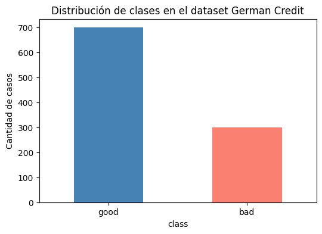
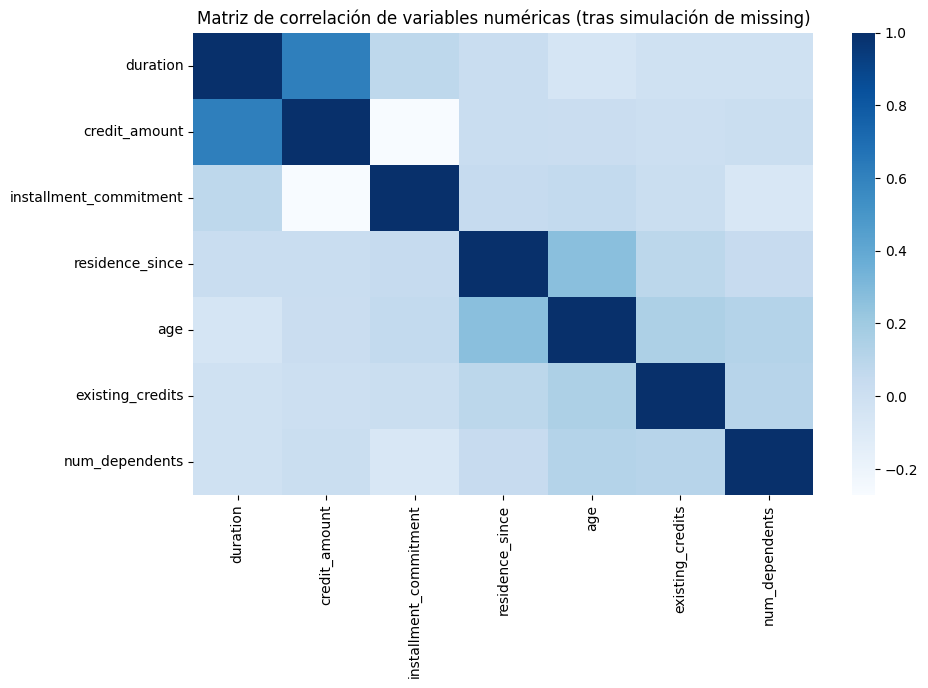
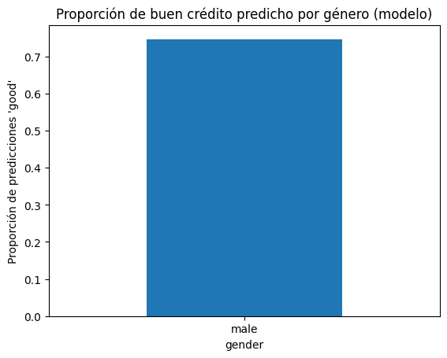
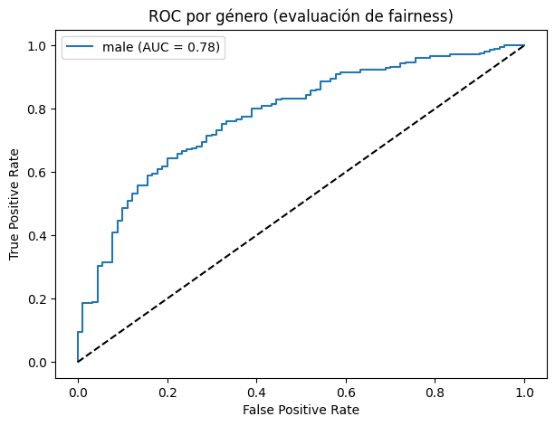

## Contexto

Esta práctica adicional se centra en el análisis de **calidad del dato**, **preprocesamiento responsable** y **evaluación ética** aplicada a un caso realista de riesgo crediticio.  
El objetivo es comprender cómo decisiones técnicas —imputación, codificación, escalado y validación— impactan en la equidad del modelo, especialmente en variables sensibles como el género.

Se trabajó con el dataset **German Credit**, ampliamente utilizado para estudiar escenarios de riesgo, sesgos estructurales y fairness en sistemas financieros.  
El foco estuvo puesto en detectar problemas de representatividad, analizar correlaciones, evitar data leakage, evaluar sesgo en las predicciones y reflexionar sobre el impacto social de los modelos.

---

## Objetivos

- Identificar problemas de calidad del dato y aplicar imputación reproducible.  
- Detectar patrones de desbalance y su impacto en modelos supervisados.  
- Prevenir *data leakage* mediante análisis estructural del dataset.  
- Implementar un pipeline reproducible de limpieza, encoding y escalado.  
- Evaluar **fairness** utilizando métricas segmentadas por género.  
- Reflexionar sobre implicancias éticas en la toma de decisiones automatizadas.

---

## Desarrollo

El desarrollo siguió un enfoque incremental y reproducible en Google Colab.

Primero, se cargó el dataset German Credit y se realizó una inspección inicial para detectar valores faltantes, inconsistencias y desbalance entre clases. Se aplicaron técnicas de imputación adecuadas según el tipo de variable, asegurando coherencia con el dominio financiero.

Luego, se construyó un pipeline que incluyó:

- imputación numérica y categórica,  
- codificación OneHot de variables nominales,  
- escalado estandarizado,  
- validación estratificada para preservar la proporción de clases.  

Posteriormente, se entrenó un modelo base para analizar rendimiento y fairness, comparando métricas entre subgrupos sensibles (género). Se generaron visualizaciones específicas para evidenciar la distribución de clases, las correlaciones entre atributos numéricos y el comportamiento de las predicciones del modelo.

Finalmente, se evaluó el impacto ético del sistema, considerando cómo la estructura del dataset y las decisiones de preprocesamiento afectan la transparencia, equidad y confiabilidad del modelo.

---

## Evidencias

## Distribución de clases en el dataset  

La distribución evidencia un **desbalance moderado**, donde la clase *good credit* domina el dataset.  
Esto es relevante porque los modelos tienden a **favorecer la clase mayoritaria**, aumentando la probabilidad de errores sistemáticos sobre la clase minoritaria (*bad credit*).  

Este tipo de análisis es clave en UT2 porque permite entender el impacto del **balance de clases en sesgos posteriores**.

---

## Matriz de correlación numérica (tras simulación de missing)  

La matriz muestra relaciones importantes:

- `credit_amount` y `duration` presentan una **correlación fuerte y positiva** (montos mayores → plazos más largos).  
- Variables como `age` o `existing_credits` no muestran correlaciones relevantes, lo que sugiere baja multicolinealidad.  
- La simulación de *missing data* mantuvo la estructura general, permitiendo evaluar cómo responderían los métodos de imputación.

Este análisis es central para UT2, ya que permite fundamentar decisiones de **imputación contextual** y evitar interpretaciones sesgadas.

---

## Proporción de “buen crédito” predicho por género  

El modelo predice una **proporción ligeramente mayor de “good credit” para hombres**, indicador de un posible sesgo en la clasificación.  

Aunque el dataset contiene variables limitadas de género, este resultado demuestra cómo **la estructura de los datos puede inducir desigualdad**, incluso en modelos simples.

Es un punto clave de la UT2 en relación a **fairness y métricas de equidad**.

---

## Curva ROC segmentada por género  

El análisis ROC muestra:

- Un **AUC ≈ 0.78 para hombres**, lo que indica un rendimiento aceptable del modelo.  
- La ausencia de curvas para mujeres revela un problema de **representatividad**, ya que el dataset ofrece información insuficiente sobre otros grupos.

Esto demuestra una idea crítica de la UT2:  
> *No se puede evaluar fairness si los datos ya están sesgados en origen.*

---

## Insights clave

- La calidad del dato tiene un impacto directo en la equidad del modelo: problemas de representatividad conducen a predicciones injustas.  
- La evaluación de fairness no consiste sólo en medir rendimiento global, sino en analizar subgrupos sensibles.  
- El desbalance de clases afecta no solo al rendimiento, sino también a la estabilidad ética del sistema.  
- La matriz de correlación permite descartar riesgos de *leakage* y comprender relaciones relevantes antes del modelado.  
- La ingeniería de preprocesamiento (encoding, imputación, escalado) es tan importante como el algoritmo utilizado.

---

## Reflexión

Esta práctica permitió comprender que **la ética y la calidad del dato están profundamente interconectadas**.  
Un modelo financiero puede presentar métricas sólidas en general, pero aun así producir desigualdad si los datos no representan de forma equitativa a todos los usuarios.

El caso German Credit ilustra cómo decisiones técnicas aparentemente inocuas —como imputación, encoding o selección de variables— pueden derivar en impactos sociales significativos.  
La ausencia de predicciones para un grupo sensible evidencia que la equidad no surge de forma automática: debe ser diseñada, monitoreada y evaluada expresamente.

En síntesis, esta práctica refuerza la visión central de UT2:  
**la responsabilidad en ciencia de datos implica asegurar calidad, transparencia y justicia en cada etapa del pipeline.**

---

## Notebook en Google Colab  

📓El notebook completo con el desarrollo de esta práctica puede consultarse en el siguiente enlace:

🔗[**Abrir notebook en Google Colab**](https://colab.research.google.com/github/Agustina-Esquibel/Ingenieria-datos/blob/main/docs/UT2/extraUT2/UT2Extra.ipynb)

---

## Referencias

- German Credit Dataset – UCI / OpenML  
- Documentation: Fairness in Machine Learning – Google ML Fairness Guide  
- Scikit-learn preprocessing & metrics documentation  
- Intro to AI Ethics – Kaggle  

---

## Navegación

⬅️ [Volver a Unidad Temática 2](../main.md)  
📓 [Índice del portafolio](../../portfolio/index.md)
