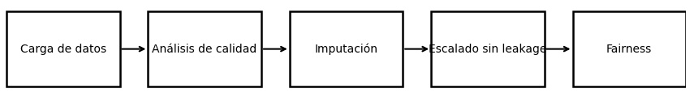

# Unidad Temática 2 – Limpieza, Imputación y Ética de Datos

En esta segunda unidad se trabajó sobre la **calidad y responsabilidad en el manejo de datos**, aplicando técnicas de imputación contextual, escalado reproducible y evaluación ética de sesgos.  
El objetivo fue asegurar la **integridad, trazabilidad y equidad** en el preprocesamiento antes del modelado.

## Prácticas realizadas

- [**Ames Housing bajo la lupa: reconstrucción de información faltante**](../UT2/practica5/main5.md)  
Imputación contextual y análisis de *missing data* para reconstruir información faltante con trazabilidad y rigor metodológico.

- [**Escalado y Anti-Leakage Pipeline: preprocesamiento ético y reproducible**](../UT2/practica6/main6.md)  
Implementación de un pipeline reproducible con escalado, normalización y control de *data leakage* entre *train* y *test*.

- [**Sesgo bajo la lupa: detección, corrección y decisiones éticas con Fairlearn**](../UT2/practica7/main7.md)  
Análisis y mitigación de sesgos en modelos predictivos, integrando métricas de equidad y reflexión ética en decisiones algorítmicas.

- [**Caso German Credit: cómo la calidad del dato condiciona la equidad en modelos financieros**](../UT2/extraUT2/extra2.md)  
Análisis aplicado que muestra cómo los errores, inconsistencias y sesgos presentes en datos crediticios afectan tanto la performance del modelo como su equidad al tomar decisiones sensibles en contextos financieros.

## Reflexión de la unidad

- **Ames Housing** permitió practicar estrategias de imputación contextual aplicadas a datos reales y heterogéneos.  
- **Anti-Leakage Pipeline** consolidó el diseño de flujos de preprocesamiento éticos y técnicamente robustos.  
- **Fairlearn** introdujo el componente social y ético del análisis de datos, vinculando rendimiento con equidad.
- **German Credit** reforzó la importancia de la calidad del dato como condición previa para la equidad: pequeñas distorsiones en atributos sensibles pueden amplificar desigualdades y conducir a decisiones injustas, incluso cuando el modelo técnico parece correcto.

En conjunto, la **UT2** marcó el paso del análisis exploratorio hacia el **procesamiento responsable de datos**, donde cada decisión técnica considera su impacto en la transparencia, la reproducibilidad y la justicia algorítmica.

## Flujo de Trabajo de UT2

Este flujo resume el proceso central de la UT2: diagnóstico de la calidad de los datos, imputación contextual, preprocesamiento sin fuga de información y evaluación ética mediante métricas de fairness.

## Conclusión final de UT2

La **Unidad Temática 2** permitió integrar técnica y reflexión, comprendiendo que la limpieza y el preprocesamiento de datos no son solo pasos previos, sino **etapas críticas para la calidad y la equidad** de los modelos.  
Estas prácticas consolidaron la base ética y metodológica necesaria para avanzar hacia la **modelización predictiva y la evaluación de desempeño** que se desarrollarán en la UT3.

- - - 

📓 [Índice del portafolio](../portfolio/index.md)
