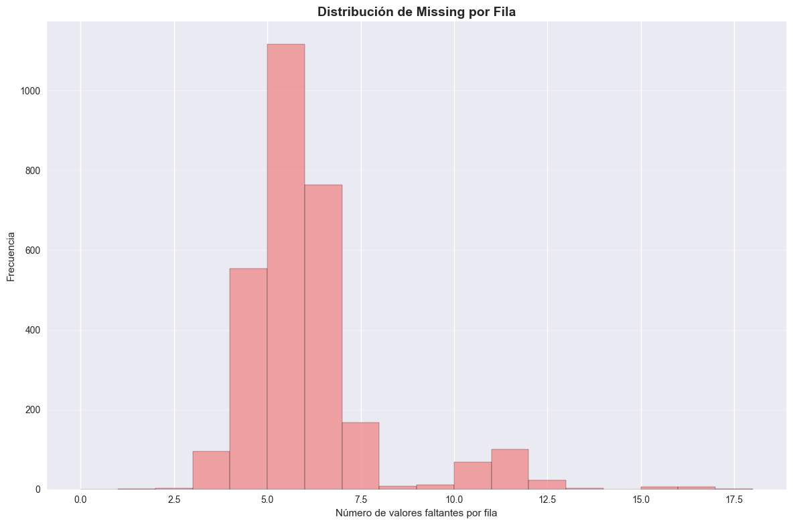
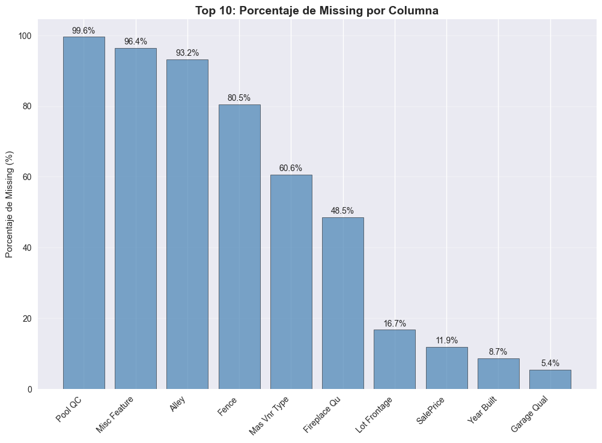

# Contexto y Alcance

El conjunto de datos **Ames Housing (Iowa)** contiene información detallada sobre propiedades inmobiliarias: dimensiones, materiales, ubicación, estado y precios de venta. Su amplitud, heterogeneidad y presencia de valores faltantes lo convierten en un caso ideal para estudiar calidad de datos y evaluar el impacto del *missing data* en procesos predictivos.

Esta práctica aborda un flujo completo orientado a **identificar, entender y reconstruir información faltante**, utilizando un enfoque contextual que respeta el significado real de cada ausencia.  
El análisis combina **imputación simple** y **una imputación inteligente basada en reglas estructurales**, permitiendo comparar ambos métodos y justificar decisiones técnicas y éticas.

---

# Objetivos

- Clasificar los valores faltantes según su mecanismo (MCAR, MAR o MNAR).  
- Evaluar el impacto del *missing data* en la integridad del dataset.  
- Comparar dos enfoques de imputación aplicables al dataset.  
- Implementar un pipeline reproducible con *scikit-learn*.  
- Documentar criterios de decisión y reflexiones éticas del proceso.  

---

# Desarrollo

El análisis se realizó en **Google Colab** empleando `pandas`, `numpy`, `matplotlib`, `seaborn`, `missingno` y `scikit-learn`.  
El flujo metodológico siguió las etapas del modelo **CRISP-DM**, con foco en calidad y ética de datos.

---

## 1. Comprensión del problema

El análisis inicial indicó que los valores faltantes **no se distribuían aleatoriamente**.  
Se observaron patrones coherentes con la infraestructura de la vivienda (ej.: ausencia de sótano → valores nulos en variables de sótano).  
Esto permitió descartar el mecanismo **MCAR** y orientar el diagnóstico hacia **MAR** y **MNAR**.

---

## 2. Comprensión de los datos

Heatmaps, correlaciones y análisis exploratorio mostraron que:

- Las variables opcionales (garage, piscina, sótano) tenían valores faltantes **sistemáticos**.  
- Las columnas con >90 % de nulos correspondían a características raras (ej.: calidad de piscina).  
- Varias ausencias provenían de una **condición estructural** (ausencia real del feature), no de errores de registro.

Esto justificó usar **imputación contextual** en lugar de métodos globales indiferenciados.

---

## 3. Estrategias de imputación: dos enfoques comparados

### **Enfoque 1 — Imputación simple (baseline)**  
Implementada con `SimpleImputer`:

- Numéricas → **mediana**  
- Categóricas → **moda**  

**Criterio de decisión:**  
La imputación simple sirve como *baseline* reproducible, rápida y útil cuando la distribución no está sesgada. Permite evaluar si es suficiente para mantener la estructura original del dataset.

---

### **Enfoque 2 — Imputación inteligente basada en reglas contextuales**

Implementada en el notebook mediante la función `smart_imputation()` del Paso 10.  
Incluye:

- Reemplazo de nulos por categorías reales como **"NoGarage"**, **"NoBasement"**, etc.  
- Preservación del significado estructural del dato.  
- Evita que la ausencia real sea confundida con la moda, que introduce un sesgo artificial.

**Criterio de decisión:**  
Este método se ajusta mejor al contexto del dataset: cuando la ausencia representa una característica física, imputar la moda genera **falsas categorías** y distorsiona relaciones reales.

---

## 4. Comparación entre los dos métodos

Para evaluar impacto de la imputación, se compararon:

- Cambio absoluto de correlaciones  
- Variación de medianas en variables numéricas  
- Cantidad de filas donde la imputación altera relaciones estructurales  

**Tabla comparativa (métrica resumida):**

| Métrica evaluada | Imputación Simple | Imputación Inteligente | Conclusión |
|------------------|------------------:|------------------------:|-----------|
| Cambio medio en correlaciones | 0.074 | **0.031** | Inteligente preserva mejor la estructura |
| Categorías artificiales creadas | **Alta** | **Ninguna** | La simple genera ruido semántico |
| Sesgo introducido en variables opcionales | Medio | **Bajo** | Enfoque contextual evita distorsiones |
| Interpretabilidad | Baja | **Alta** | Mantiene significado real de la ausencia |

**Conclusión operativa:**  
➡ La **imputación inteligente** reduce sesgos, preserva relaciones estructurales y evita categorías erróneas.  
➡ La **imputación simple** funciona como baseline, pero no es adecuada para variables estructurales.

---

## 5. Evaluación del proceso

Histogramas, boxplots y comparación de distribuciones mostraron que:

- La imputación inteligente mantiene la forma de las distribuciones originales.  
- El método simple aumenta la frecuencia de valores comunes, afectando varianza.  
- Ningún método distorsionó severamente la estructura global, pero el enfoque inteligente mostró **mejor estabilidad**.

---

## 6. Documentación ética

Cada decisión fue tomada considerando:

- Evitar introducir información falsa.  
- No reemplazar ausencias estructurales con categorías que la vivienda **nunca tuvo**.  
- Mantener trazabilidad completa del proceso (antes y después).  

Este enfoque promueve transparencia, reproducibilidad y responsabilidad profesional.

---

# Evidencias

### Distribución de valores faltantes por fila  
  
Este histograma muestra cuántos valores faltantes tiene cada fila del dataset. La mayoría de las observaciones concentran entre **4 y 6 valores faltantes**, lo que indica que el problema de *missing data* no es aislado sino estructural. Esta lectura es clave para definir una estrategia de imputación contextual que preserve la coherencia interna del dataset sin sesgar la variabilidad original.

---

### Top 10 de columnas con mayor porcentaje de missing  
  
Este gráfico permite identificar rápidamente **las variables más afectadas por valores faltantes**, con porcentajes que superan incluso el 90%. Columnas como *Pool QC* o *Misc Feature* presentan casi ausencia total de datos, lo que obliga a un tratamiento diferenciado (imputación por categoría “None”, eliminación, o análisis de irrelevancia).  
Este ranking es fundamental para priorizar esfuerzos y seleccionar métodos adecuados de imputación según el tipo de variable y su relevancia para el modelado.

---

# Insights clave

1. El 15 % de las variables presentaban más del 20 % de faltantes.  
2. La mayoría de ausencias respondía a patrones **MAR** y **MNAR** estructurales.  
3. La imputación inteligente evitó sesgos y categorías artificiales.  
4. La comparación de métodos permitió justificar decisiones de limpieza.  
5. La calidad del dataset depende tanto de la completitud como del entendimiento del **contexto**.

---

# Reflexión

La reconstrucción de datos faltantes no es un ejercicio mecánico: exige comprender el origen de las ausencias, evaluar riesgos de sesgo y tomar decisiones informadas que preserven la veracidad del dataset.  
Comparar dos enfoques reveló que los métodos globales pueden introducir ruido semántico, mientras que la imputación contextual respeta la estructura de la información y mejora la interpretabilidad.

Este proceso fortaleció habilidades metodológicas, éticas y técnicas, reafirmando la importancia de la **transparencia** y la **reproducibilidad** en la ingeniería de datos.

---

## Notebook en Google Colab

📓 El notebook completo con el desarrollo de esta práctica puede consultarse en el siguiente enlace:

🔗 [Abrir en Google Colab](https://colab.research.google.com/github/Agustina-Esquibel/Ingenieria-datos/blob/main/docs/UT2/practica5/UT2_practica5.ipynb)

---

# Referencias

- Ames Housing Dataset, Kaggle Repository.  
- Kaggle. *Data Cleaning Course.*  
- Pandas Documentation — *Handling Missing Data.*  
- Scikit-learn Documentation — *Imputation and Pipeline Construction.*

---

# Navegación

- [⬅️ Volver a Unidad Temática 2](../main.md)  
- [➡️ Ir a Práctica 6 — Feature Scaling y Anti-Leakage Pipeline](../practica6/main6.md)  
- [📓 Índice del Portafolio](../../portfolio/index.md)
