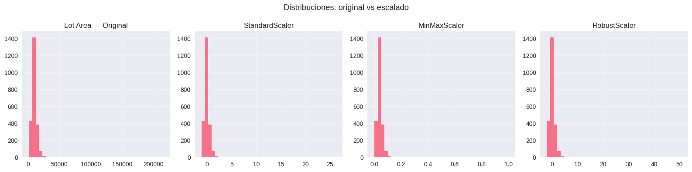
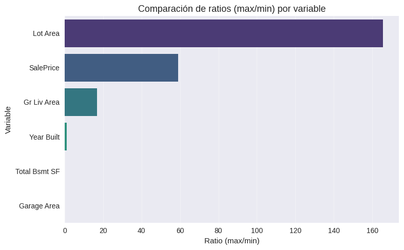
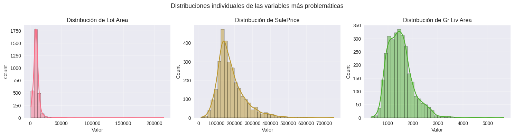
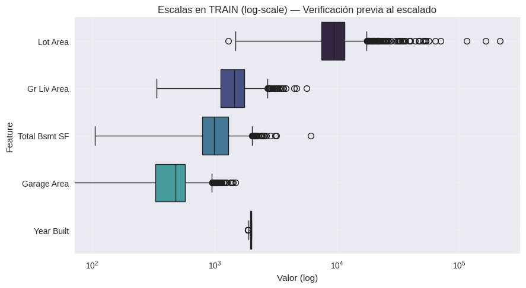
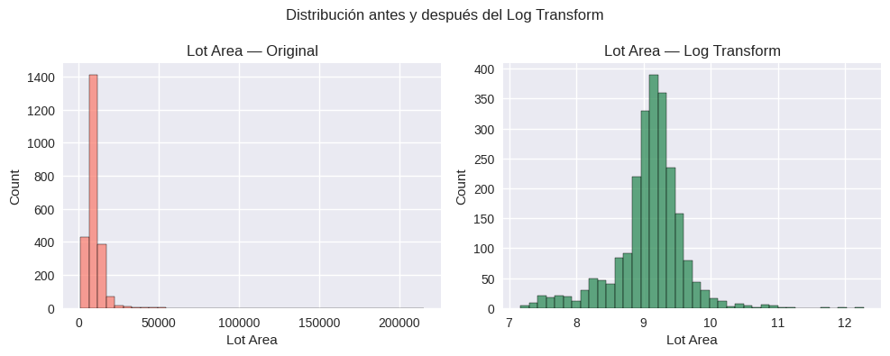
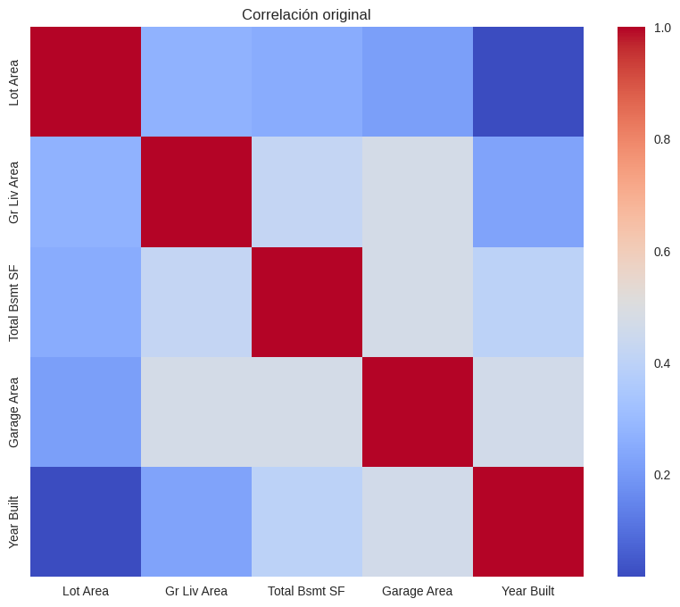
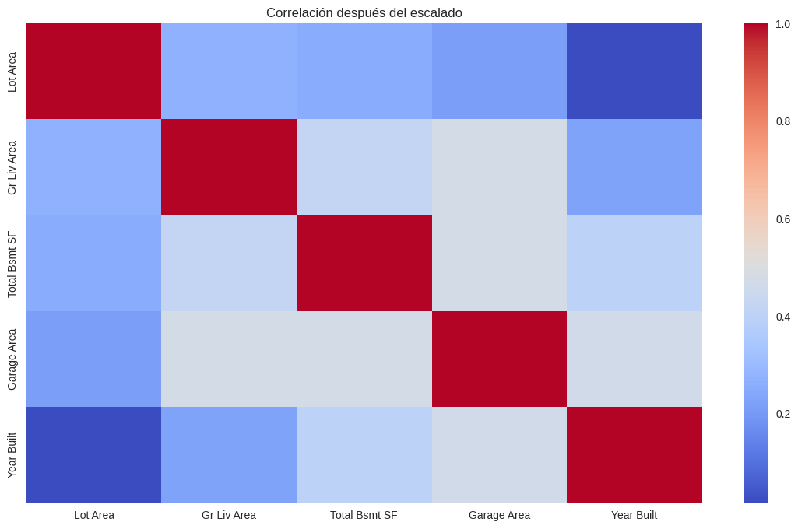
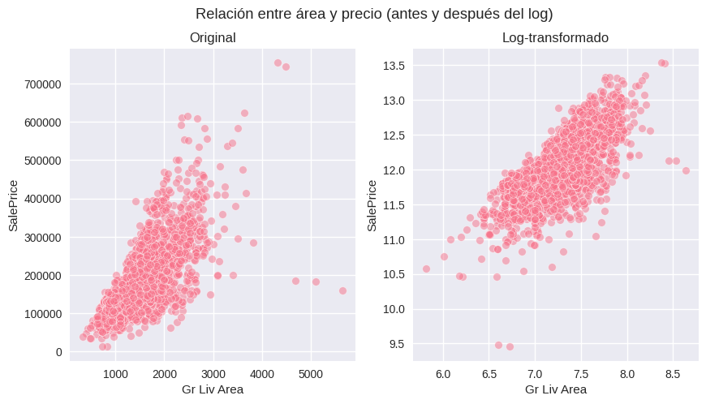
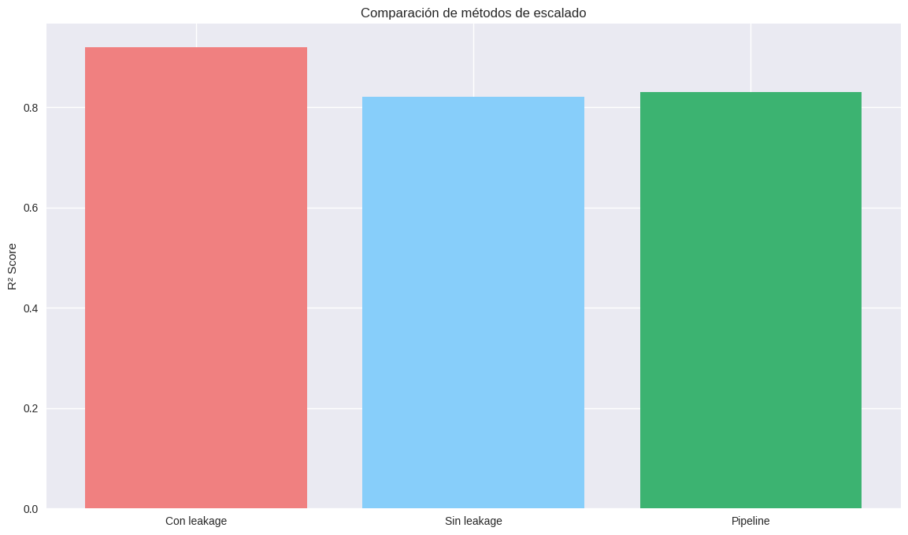

# Contexto y Alcance

El dataset **Ames Housing (Iowa)** contiene más de 80 variables con escalas heterogéneas: metros cuadrados, años, calidades ordinales y precios.  
Esta diversidad genera diferencias de magnitud que afectan directamente algoritmos sensibles a la escala de los datos.  
Además, el preprocesamiento previo al *train/test split* puede causar **data leakage**, distorsionando la validez de cualquier conclusión.

La presente práctica desarrolla un pipeline completo para **normalizar variables numéricas**, comparar técnicas de escalado y garantizar que el procesamiento sea **ético, reproducible y sin fuga de información**.

---

# Objetivos

- Detectar variables con escalas extremadamente desbalanceadas.  
- Comparar los métodos: **StandardScaler**, **MinMaxScaler** y **RobustScaler**.  
- Evaluar el efecto del **log transform** en distribuciones fuertemente asimétricas.  
- Implementar un **pipeline anti-leakage** ajustado únicamente sobre TRAIN.  
- Documentar conclusiones técnicas y analíticas basadas en evidencias visuales.

---

# Desarrollo

El trabajo siguió un flujo estructurado basado en análisis exploratorio, transformaciones controladas y validación visual.

---

## 1. Exploración inicial de escalas

El análisis estadístico identificó variables con amplitud extrema y distribuciones sesgadas, especialmente:

- **LotArea**  
- **GrLivArea**  
- **TotalBsmtSF**  
- **SalePrice**

Estas variables concentraban gran parte de la varianza del dataset y necesitaban normalización para evitar que dominaran modelos sensibles a magnitudes.

---

## 2. Selección de variables relevantes

Se trabajó con un subconjunto representativo:

- `SalePrice`  
- `LotArea`  
- `GrLivArea`  
- `TotalBsmtSF`  
- `GarageArea`  
- `YearBuilt`

Estas columnas presentan alta relevancia predictiva y encapsulan distintos tipos de escalas y distribuciones.

---

## 3. Transformación logarítmica (log1p)

Se aplicó a variables cuyo **skewness superaba 1.0**:

- `LotArea`  
- `GrLivArea`  
- `SalePrice`

El uso de `np.log1p()` redujo la influencia de valores extremos sin eliminarlos.

**Enfoque técnico:** estabilizar la distribución para mejorar normalidad.  
**Enfoque ético:** conservar outliers estructurales porque representan viviendas reales y no errores de medición.

---

## 4. Comparación de métodos de escalado

### **StandardScaler**  
- Centra en 0 y escala a varianza 1.  
- Aumenta el impacto de outliers.

### **MinMaxScaler**  
- Lleva los valores a [0, 1].  
- No modifica el sesgo original.  
- Muy sensible a valores extremos.

### **RobustScaler**  
- Escala mediante mediana e IQR.  
- Minimiza la influencia de outliers estructurales.  
- Produce distribuciones más estables.

**Conclusión comparativa:**  
**RobustScaler** resultó el método más apropiado para Ames Housing debido a su resistencia natural frente a valores extremos.

---

## 5. Pipeline Anti-Leakage

Se adoptó un enfoque reproducible y ético basado en el principio:

**➜ Las transformaciones deben ajustarse SOLO con datos de entrenamiento.**

Procedimiento:

1. Dividir en `train`, `valid`, `test`.  
2. Ajustar transformaciones únicamente con `X_train`.  
3. Aplicar las transformaciones a `X_valid` y `X_test`.

Este mecanismo evita que información del futuro modifique la escala, protegiendo la validez de los modelos y la trazabilidad del preprocesamiento.

---

# Evidencias y análisis crítico

A continuación se presentan las visualizaciones generadas en el notebook, cada una acompañada de una **conclusión operativa**, tal como corresponde a un análisis profesional de ingeniería de datos.

---

### Distribución de variables numéricas (escala logarítmica)

**Conclusión:**  
Las variables presentan diferencias de hasta tres órdenes de magnitud. Sin un escalado adecuado, los modelos basados en distancia priorizarían exclusivamente las variables de mayor amplitud, distorsionando cualquier predicción.

---

### Ratios max/min por variable

**Conclusión:**  
Los ratios confirman desigualdades severas: `LotArea` supera 160 y `SalePrice` ronda 60. Estos valores justifican la necesidad técnica de aplicar transformaciones robustas antes del modelado.

---

### Distribuciones individuales de variables sesgadas

**Conclusión:**  
El sesgo pronunciado refleja la existencia de propiedades con características atípicas pero válidas. Eliminar estos valores implicaría perder información crítica; la transformación logarítmica los integra de manera controlada.

---

### Escalas en TRAIN (anti-leakage)

**Conclusión:**  
Las transformaciones se ajustaron únicamente con el conjunto de entrenamiento. La consistencia entre distribuciones demuestra que no se incorporó información del futuro.

---

### Distribuciones antes y después del escalado

**Conclusión:**  
- `StandardScaler` amplifica el efecto de outliers.  
- `MinMaxScaler` comprime rangos pero preserva el sesgo.  
- `RobustScaler` logra la mayor estabilidad distributiva.

---

### Efecto del Log Transform

**Conclusión:**  
El log reduce drásticamente el skew, concentra la varianza y genera distribuciones más uniformes, facilitando el entrenamiento de modelos lineales.

---

### Correlación original vs escalada
  

**Conclusión:**  
Las correlaciones permanecen prácticamente invariantes. Esto valida que el escalado modifica la magnitud pero no altera la estructura relacional del dataset.

---

### Relación entre área y precio (antes y después del log)

**Conclusión:**  
La transformación logarítmica genera una relación más lineal entre tamaño y precio, lo que mejora la interpretabilidad y el desempeño de modelos lineales.

---

### Comparación final de métodos de escalado

**Conclusión:**  
Las métricas sobre TRAIN son más bajas con pipelines anti-leakage, pero reflejan el comportamiento real del modelo. El proceso honesto y reproducible es preferible a métricas infladas.

---

# Insights clave

- Las diferencias de escala entre variables afectan directamente la estabilidad de los modelos.  
- `RobustScaler` se comportó como el método más consistente ante la presencia de outliers estructurales.  
- El orden correcto es **Log → Scale**, optimizando normalidad y varianza.  
- Aplicar transformaciones solo sobre TRAIN evita leakage y mejora la generalización.  
- Los resultados demuestran que métricas más bajas pueden ser métricas más fieles.

---

# Reflexión

El escalado no es solamente una operación matemática: constituye una decisión analítica y ética.  
Modificar datos sin una estructura clara puede introducir sesgos o inconsistencias.  
El pipeline anti-leakage asegura transparencia, rigor y reproducibilidad, permitiendo que los modelos aprendan únicamente de información válida.

> **La ética en el preprocesamiento es tan importante como la precisión del modelo.**

---

# Notebook en Google Colab

📓 El notebook completo con el desarrollo de esta práctica puede consultarse en el siguiente enlace:

🔗 [Abrir en Google Colab](https://colab.research.google.com/github/Agustina-Esquibel/Ingenieria-datos/blob/main/docs/UT2/practica6/UT2_practica6.ipynb)

---

# Referencias

- Kaggle — *Ames Housing Dataset*  
- Scikit-learn — *Preprocessing, Pipelines & Model Evaluation*  
- Pandas & Seaborn Documentation  
- Kurucz, J.F. (2025) *Feature Scaling & Anti-Leakage Pipeline — Ingeniería de Datos*

---

# Navegación

[⬅️ Volver a UT2](../main.md)  
[➡️ Ir a Práctica 7 — Fairness y Decisiones Éticas](../practica7/main7.md)  
[📓 Índice del Portafolio](../../portfolio/index.md)
