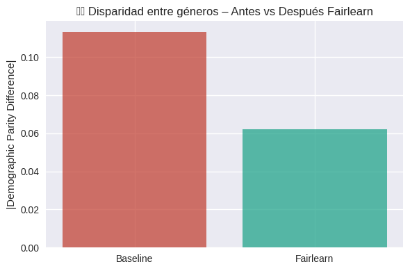
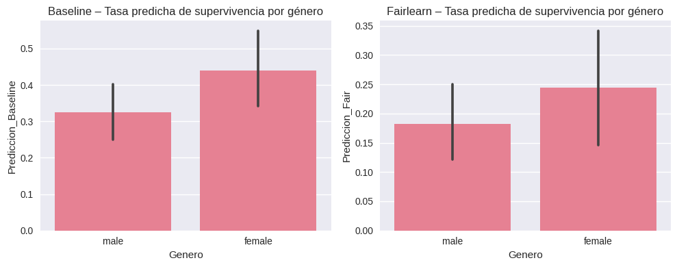
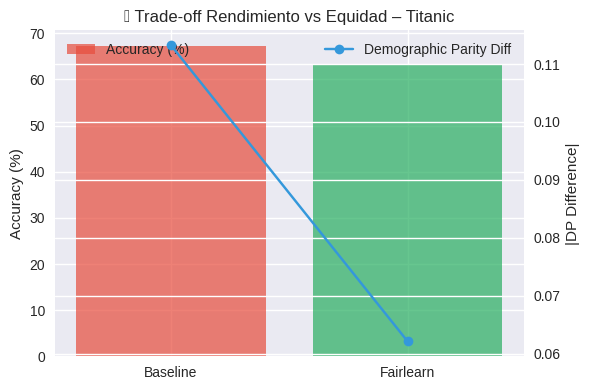
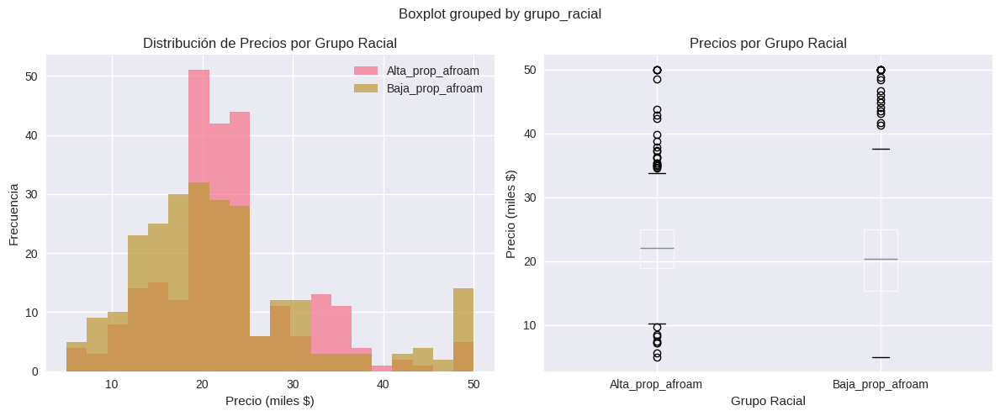

# Contexto y Alcance

Los modelos de aprendizaje automático reproducen patrones presentes en los datos históricos que los entrenan.  
Cuando esos datos contienen desigualdades estructurales —raciales, socioeconómicas, de género— el modelo puede amplificarlas, afectando decisiones sensibles.  

Esta práctica aborda **la detección y mitigación de sesgos algorítmicos** mediante dos casos complementarios:

1. **Boston Housing (Regresión):** dataset que incluye una variable racial controversial que influye en el precio de la vivienda.  
2. **Titanic (Clasificación):** dataset donde aparecen diferencias marcadas en tasas de supervivencia según género y clase social.

El trabajo se centra en **medir sesgos, aplicar métodos de mitigación con Fairlearn y analizar las implicancias éticas** de cada decisión.

---

# Objetivos

- Detectar y cuantificar desigualdades presentes en modelos predictivos.  
- Analizar el rol de las variables sensibles y su impacto en la equidad.  
- Aplicar técnicas de fairness (`ExponentiatedGradient`, *constraints* de Paridad Demográfica).  
- Evaluar el compromiso entre precisión y justicia.  
- Reflexionar sobre el rol ético del científico de datos frente a sesgos estructurales.

---

# Desarrollo

## 1. Carga, reconstrucción y preparación de los datasets

- **Boston Housing:**  
  - Se reconstruyó la variable racial original (`B`) mediante la fórmula histórica.  
  - Se exploró la relación entre composición racial y valor de la vivienda.  

- **Titanic:**  
  - Se imputaron edades faltantes y se codificaron variables categóricas.  
  - Se identificaron las variables sensibles: **género** y **clase**.

## 2. Análisis inicial del sesgo

- **Boston:** se midió la correlación entre la variable racial y el precio medio de la vivienda (MEDV).  
  Esta correlación negativa refleja desigualdades históricas en distribución territorial y política de crédito.

- **Titanic:** se calcularon tasas de supervivencia por género y clase.  
  Las mujeres presentan el doble de probabilidad de sobrevivir respecto a los hombres; la 1ª clase supera ampliamente al resto.

**Criterio de decisión:**  
El análisis exploratorio permite determinar **dónde** y **cómo** se manifiesta el sesgo, para seleccionar el método de mitigación adecuado.

## 3. Entrenamiento de modelos baseline

- **Boston Housing:** se entrenaron dos modelos de regresión lineal:  
  - Modelo A: incluye variable racial.  
  - Modelo B: excluye variable racial.  

  Esto permite medir cuánto aporta la variable sensible al performance y al sesgo.

- **Titanic:** se entrenó un **Random Forest baseline** sin restricciones de equidad.

**Aprendizaje:**  
Los modelos sin control de fairness pueden exhibir buen rendimiento numérico, aun siendo profundamente injustos en subgrupos sensibles.

## 4. Mitigación con Fairlearn

Se aplicó el método **ExponentiatedGradient** con el constraint **Demographic Parity** usando género como variable sensible.

**Criterio de decisión:**  
La paridad demográfica permite evaluar si el modelo asigna predicciones positivas con la misma frecuencia en distintos grupos, independientemente del resultado real.  
Se eligió este método porque facilita comparar el “antes vs después” sin modificar el dataset original.

## 5. Evaluación final

Se analizaron dos dimensiones:

1. **Rendimiento (accuracy / MAE).**  
2. **Equidad (disparidad entre grupos).**

Esto permitió estudiar el clásico *trade-off* entre precisión y justicia.

---

# Evidencias

## 📊 Disparidad entre géneros – Antes vs Después de Fairlearn

**Observación técnica:**  
La disparidad demográfica cae de ~0.11 en el modelo baseline a ~0.06 tras aplicar Fairlearn.

**Interpretación analítica:**  
El modelo corregido disminuye la brecha entre hombres y mujeres en la probabilidad de supervivencia predicha.

**Conclusión operativa:**  
La mitigación algorítmica logra mejorar la equidad **sin tocar los datos**, actuando directamente sobre el proceso de entrenamiento.

---

## 📊 Tasa predicha de supervivencia por género

**Observación técnica:**  
El modelo baseline favorece sistemáticamente a las mujeres; Fairlearn reduce esa diferencia y acerca las tasas.

**Interpretación analítica:**  
El modelo mitigado deja de reproducir el patrón “mujeres sobreviven más”, evitando una repetición acrítica de sesgos sociales.

**Conclusión operativa:**  
El ajuste suaviza diferencias injustificadas, manteniendo la estructura general de los datos sin eliminar información relevante.

---

## 📊 Trade-off entre rendimiento y equidad

**Observación técnica:**  
El accuracy baja de ~68% a ~64%, pero la disparidad se reduce casi a la mitad.

**Interpretación analítica:**  
La equidad exige sacrificar una porción del rendimiento; este descenso es natural y esperado.

**Conclusión operativa:**  
Un modelo “menos preciso pero más justo” suele ser preferible en contextos sociales o sensibles.

---

## 📊 Distribución de precios por grupo racial (Boston Housing)

**Observación técnica:**  
Las zonas con mayor proporción de población afroamericana muestran valores medios más bajos y mayor dispersión.

**Interpretación analítica:**  
El modelo puede aprender asociaciones históricas injustas entre raza y precio, transfiriendo desigualdades al proceso predictivo.

**Conclusión operativa:**  
La variable racial debe usarse con extrema cautela y, en la mayoría de los casos, excluirse del modelo productivo.

---

# Insights clave

1. Los modelos pueden ser precisos pero profundamente injustos.  
2. Las variables sensibles no deben eliminarse sin analizar primero su impacto.  
3. Los métodos de fairness permiten cuantificar desigualdades de forma estructurada.  
4. El *trade-off* entre rendimiento y equidad es inevitable y debe gestionarse deliberadamente.  
5. La evaluación ética es parte integral del ciclo de vida del modelo.

---

# Reflexión

El experimento mostró que **no existe neutralidad algorítmica**.  
Los modelos aprenden del mundo tal como es, no como debería ser, y pueden amplificar desigualdades invisibles si no se interviene.

En **Boston Housing**, la variable racial mejora el ajuste, pero perpetúa diferencias históricas en valor de vivienda.  
La decisión de excluirla representa un acto de responsabilidad profesional.

En **Titanic**, las diferencias de supervivencia son reales, pero un modelo destinado a decisiones modernas debe evitar replicarlas acríticamente.  
La mitigación con Fairlearn permitió construir un modelo más equilibrado, revelando que la equidad es alcanzable sin sacrificar completamente el rendimiento.

La práctica deja una lección central:  
**la ética no es un complemento técnico, sino un requisito para construir modelos válidos, confiables y justos**.

---

# Notebook en Google Colab

📓 El notebook completo con el desarrollo de esta práctica puede consultarse en el siguiente enlace:

🔗 [Abrir en Google Colab](https://colab.research.google.com/github/Agustina-Esquibel/Ingenieria-datos/blob/main/docs/UT2/practica7/UT2_practica7.ipynb)

---

# Referencias

- Fairlearn Documentation  
- Scikit-learn: *Fairness, Ethics & Model Evaluation*  
- CMU Boston Housing Dataset (1978)  
- Titanic Dataset (Kaggle / Seaborn)

---

# Navegación

[⬅️ Volver a Práctica 6 — Feature Scaling y Anti-Leakage Pipeline](../practica6/main6.md)  
[⬅️ Volver a UT2](../main.md)  
[📓 Índice del Portafolio](../../portfolio/index.md)
