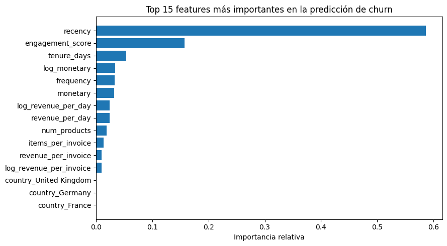
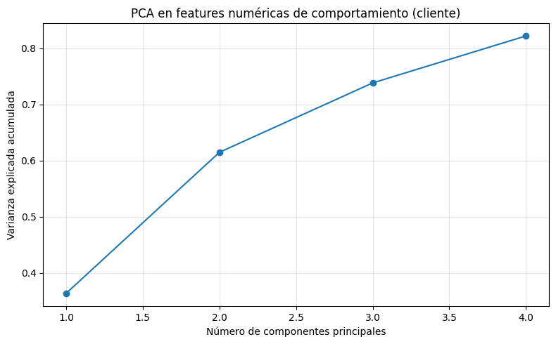
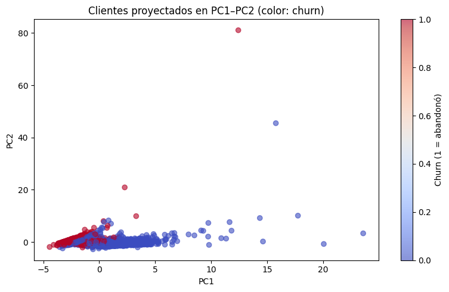

## Contexto

Este caso adicional profundiza en técnicas de **feature engineering, codificación categórica, reducción dimensional y análisis interpretativo** para comprender los factores que influyen en el abandono (*churn*) de clientes en un contexto de retail online.

El objetivo fue construir un pipeline reproducible capaz de transformar datos transaccionales en señales predictivas, capturando patrones de comportamiento y enriqueciendo la representación del cliente para modelos supervisados.  
El enfoque incluye construcción de features RFM, encoding de países, PCA para exploración estructural e interpretación del modelo mediante importancia de variables.

---

## Objetivos

- Diseñar features significativas basadas en comportamiento real del cliente.
- Implementar técnicas de codificación categórica avanzadas sin inflar dimensionalidad.
- Aplicar PCA para detectar estructuras internas y redundancias.
- Entrenar un modelo interpretable y analizar qué variables explican mejor el churn.
- Visualizar diferencias entre clientes retenidos y abandonados.
- Integrar un pipeline reproducible en Google Colab con limpieza, encoding y modelado.

---

## Desarrollo del caso

El trabajo se organizó en cuatro etapas:

### 1. Preparación y construcción de features

Se diseñaron variables clave basadas en la lógica comercial del retail:

- **Recency**: días desde la última compra.  
- **Frequency**: cantidad total de compras.  
- **Monetary value**: gasto acumulado por cliente.  
- **Engagement score**: métrica combinada que resume actividad reciente, diversidad de productos y recurrencia.

Estas variables capturan señales tempranas de abandono y enriquecen la representación del cliente.  
Se eligió este enfoque porque RFM y engagement son estándares probados en análisis de churn y permiten obtener interpretabilidad clara.

---

### 2. Codificación categórica y tratamiento de países

Las variables de país son tradicionalmente ruidosas y con alta cardinalidad relativa.  
Para evitar dimensionalidad excesiva se aplicaron **target encoding** y **one-hot encoding**, comparando impacto en el modelo y verificando su relación con el churn.

El objetivo fue capturar patrones geográficos manteniendo un equilibrio entre representación y estabilidad estadística.

---

### 3. Reducción dimensional con PCA

Para analizar la estructura interna de las features numéricas se aplicó PCA.  
Esto permitió:

- Identificar redundancias.  
- Observar cuánta varianza se conserva con pocos componentes.  
- Facilitar visualizaciones bidimensionales que representan grupos de clientes según comportamiento.  

---

### 4. Entrenamiento del modelo y análisis de importancia de features

Se entrenó un modelo de **gradient boosting**, dado su capacidad para capturar relaciones no lineales sin requerir excesiva ingeniería adicional.

La importancia de features permitió identificar qué variables impactan más en el abandono, aportando interpretabilidad directa para decisiones de negocio.

---

## Evidencias

### Distribución de clientes por estado de churn  

La distribución revela un desbalance moderado: aproximadamente el doble de clientes retenidos respecto a abandonados.  
Este patrón es habitual en contextos reales, donde el abandono es un evento menos frecuente.  
El desbalance implica que el modelo debe evaluarse cuidadosamente para evitar que la clase mayoritaria domine las predicciones.

---

### Recency (días desde última compra) por estado de churn  

El boxplot muestra una diferencia marcada:

- Clientes **con churn** tienen recency muy superior (más días sin comprar).  
- Clientes **retenidos** presentan recency mucho menor y más concentrado.

Este resultado confirma la relevancia de *recency* como predictor clave, validando la elección del feature RFM.

---

### Importancia de features en la predicción de churn  

Las variables más influyentes fueron:

- **Recency**: principal señal de abandono.  
- **Engagement score**: resume comportamiento y actividad reciente.  
- **Tenure days**: antigüedad del cliente.  
- **Log-monetary y frecuencia**: indicadores de valor y recurrencia.

Los países aparecen con baja importancia, lo que confirma que la codificación categórica no domina indebidamente al modelo.

---

### PCA – Varianza explicada acumulada  

El PCA revela que:

- Los **primeros dos componentes** explican más del 70% de la varianza.  
- Con **cuatro componentes** se supera el 85%.  

Esto indica que las features numéricas tienen estructura clara y redundancias que pueden comprimirse sin perder demasiada información.

---

### Proyección de clientes en PC1–PC2 coloreada por churn  

El gráfico muestra que:

- Los clientes abandonados (rojo) tienden a agruparse en zonas asociadas a **recency alta y engagement bajo**.
- Los clientes retenidos (azul) están más dispersos en áreas de menor riesgo.  
- Aunque no existe una separación lineal perfecta, sí se observan patrones comportamentales que justifican el modelado.

Esta visualización ayuda a interpretar cómo se distribuyen los clientes en un espacio reducido y valida la utilidad del PCA para exploración.

---

## Insights clave

- **Recency y engagement** son los predictores dominantes del churn.  
- La ingeniería de features basada en comportamiento supera ampliamente a las variables originales del dataset.  
- La codificación categórica controlada evita dimensionalidad excesiva sin perder información relevante.  
- El PCA muestra que la estructura del comportamiento del cliente puede representarse con pocos componentes.  
- La combinación de RFM + engagement + modelado interpretativo produce un pipeline sólido y replicable.

---

## Reflexión

El caso demuestra que el **feature engineering es el núcleo del análisis de churn**.  
Las transformaciones aplicadas permitieron capturar señales tempranas de abandono, facilitando tanto la interpretación como la capacidad predictiva del modelo.

Además, la combinación de técnicas —RFM, encoding, PCA y modelos interpretables— evidencia cómo cada decisión técnica influye en la calidad final del análisis y en su aplicabilidad real dentro del negocio.

Este ejercicio refuerza la importancia de:

- diseñar features alineadas al dominio,  
- evaluar estructuras internas antes de modelar,  
- y usar visualizaciones para interpretar el comportamiento del cliente.  

---

## Notebook en Google Colab

📓El notebook completo con el desarrollo de está práctica puede consultarse en el siguiente enlace:

🔗[Abrir notebook en Google Colab](https://colab.research.google.com/github/Agustina-Esquibel/Ingenieria-datos/blob/main/docs/UT3/extraUT3/UT3extra.ipynb)

---

## Referencias

- Feature Engineering for Machine Learning – Zheng & Casari, O’Reilly.  
- Scikit-learn preprocessing & decomposition documentation.  
- Customer Analytics frameworks: RFM & engagement modeling.  
- Kaggle Feature Engineering Course.

---

## Navegación

⬅️ [Volver a Unidad Temática 3](../main.md)  
📓 [Índice del portafolio](../../portfolio/index.md)
