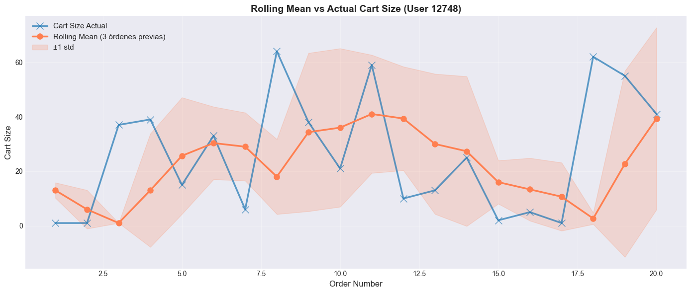
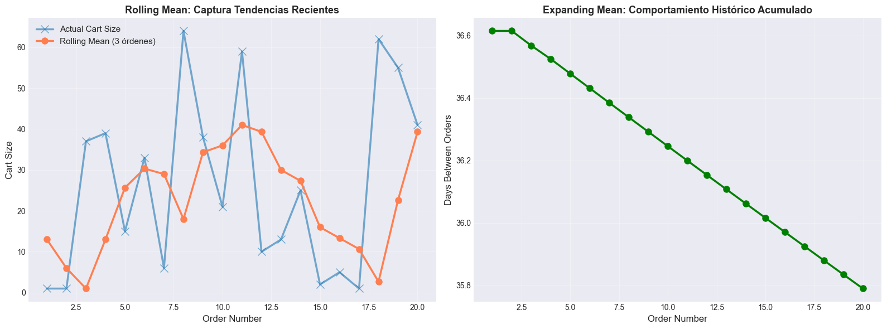
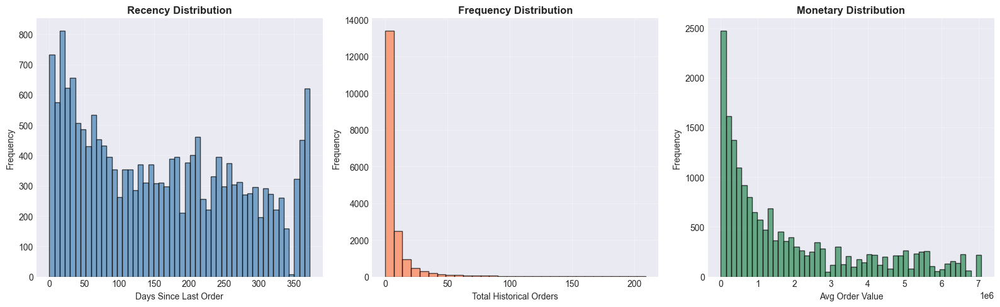
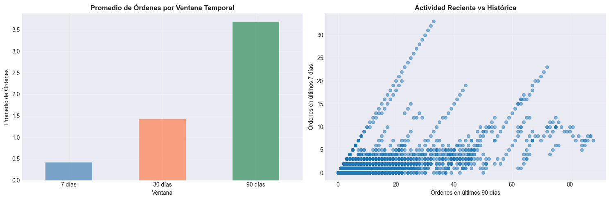
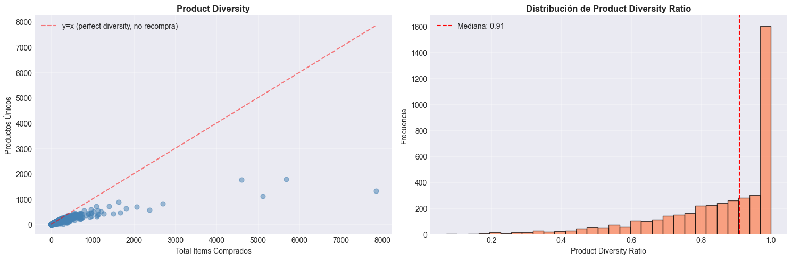
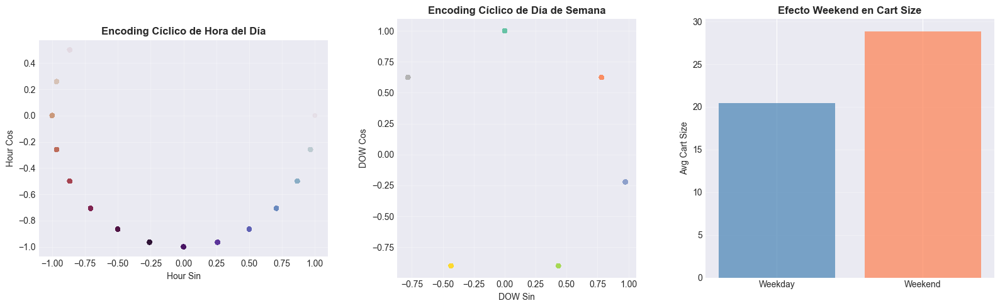
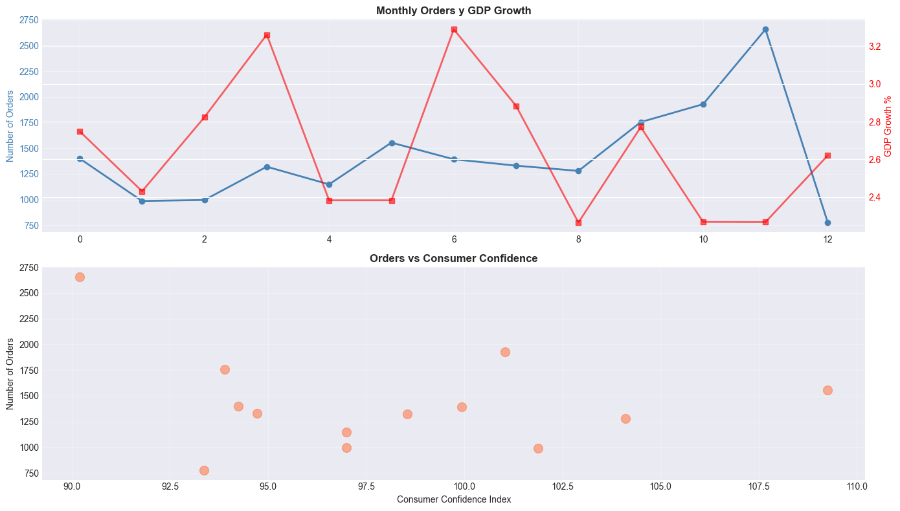
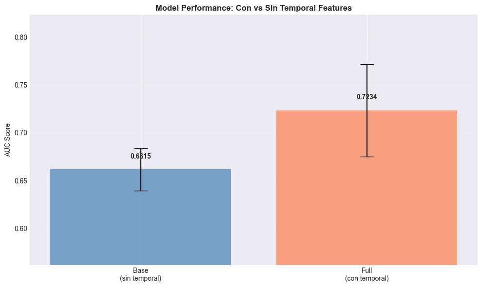
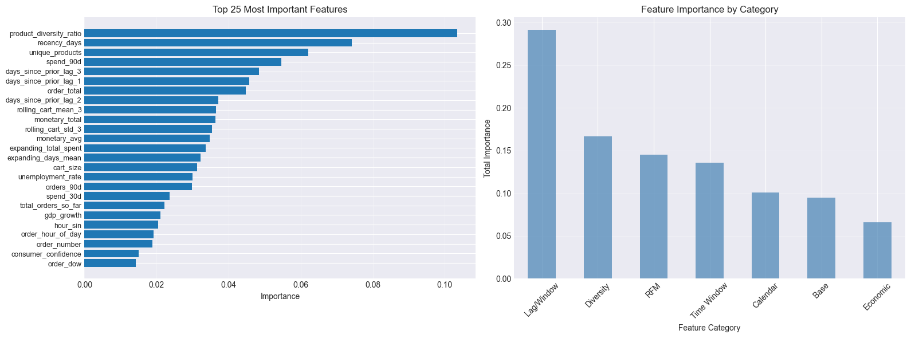

## Contexto
Esta práctica se enfoca en el diseño e implementación de **temporal feature engineering** aplicado a un caso real de e-commerce utilizando el dataset *Online Retail (UK, 2010-2011)*.  
El objetivo es demostrar cómo la construcción de variables basadas en historial, tendencia, estacionalidad y comportamiento acumulado permite **predecir si un usuario volverá a comprar** en el futuro cercano.

El enfoque combina técnicas de **lag features**, **rolling windows**, **expanding windows**, **RFM analysis**, **calendar features** y **variables externas**, integradas en un flujo temporal estricto que evita *data leakage*.  
El resultado muestra cómo el tiempo —correctamente modelado— se convierte en un recurso predictivo clave para entender y anticipar patrones de compra.

---

## Objetivos  
- Construir un flujo completo de **feature engineering temporal** a nivel order-level.  
- Crear features basadas en historial reciente (lag), ventanas móviles y acumulados.  
- Aplicar el framework **RFM** para evaluar recencia, frecuencia y valor monetario.  
- Incorporar **calendar features** y encoding cíclico (sin/cos).  
- Integrar variables externas mensuales sin contaminar la información del futuro.  
- Validar modelos mediante **TimeSeriesSplit** para garantizar integridad temporal.  
- Comparar un modelo base con un modelo enriquecido con temporal features.

---

## Actividades 

1. **Set up y carga de datos**  
   - Configuración del entorno en Google Colab.  
   - Autenticación con Kaggle API y descarga del dataset Online Retail (~540k filas).  
   - Limpieza de datos: eliminación de cancelaciones, cantidades negativas y CustomerID nulos.

2. **Agregación al nivel de orden**  
   - Cálculo de métricas por orden: `cart_size`, `order_total`, secuencia de orden.  
   - Ordenamiento cronológico estricto por usuario.

3. **Creación de temporal features**  
   - **Lag features** para capturar intervalos entre compras previas.  
   - **Rolling windows** para medias y desviaciones en las últimas órdenes.  
   - **Expanding windows** como acumulados históricos por usuario.  
   - **Time windows (7d, 30d, 90d)** mediante filtros por rango temporal.

4. **RFM Analysis**  
   - `recency_days`: días desde la última compra.  
   - `total_orders_so_far`: frecuencia acumulada.  
   - `monetary_total` y `monetary_avg`: gasto histórico.

5. **Calendar Features + Encoding Cíclico**  
   - Día de semana, hora, fin de mes, fines de semana, feriados.  
   - Transformación cíclica (sin/cos) para patrones semanales y horarios.

6. **Variables externas**  
   - Inclusión de `gdp_growth`, `unemployment_rate` y `consumer_confidence`.  
   - Unión temporal mediante forward fill para evitar conocer el futuro.

7. **Construcción del target**  
   - Variable binaria `will_purchase_again`, indicando si el usuario repite compra.

8. **Validación temporal y modelado**  
   - Separación con **TimeSeriesSplit (3 folds)**.  
   - Entrenamiento de un **Random Forest Classifier**.  
   - Comparación entre modelo base y modelo enriquecido.

9. **Análisis de importancia de features**  
   - Ranking global y por categorías: lag/window, RFM, calendar, external, base.

---

## Desarrollo  

El desarrollo se implementó siguiendo un flujo temporal estricto.  
Se inició con la construcción de un dataset ordenado por usuario y fecha, asegurando que todas las operaciones de `.shift()`, `.rolling()` y `.expanding()` se basaran únicamente en información disponible hasta cada punto temporal.

Las **lag features** permitieron capturar la proximidad entre compras, mientras que las **rolling windows** reflejaron la estabilidad o variabilidad reciente del comportamiento del usuario. Las **expanding windows** aportaron una visión acumulada de la relación del cliente con la plataforma.

El análisis RFM añadió una capa interpretativa sobre el valor histórico de los usuarios, mientras que las calendar features capturaron hábitos y estacionalidad inherentes al comportamiento humano (fines de semana, horarios, fin de mes).  
Las variables externas se incorporaron como contexto macroeconómico, aunque su peso predictivo fue menor.

La validación con **TimeSeriesSplit** fue fundamental para preservar la integridad temporal y evitar *data leakage*, replicando el escenario real donde el futuro nunca puede influir en el pasado.

Finalmente, se evaluó la mejora del modelo al incorporar temporal features, verificando la importancia relativa de cada categoría y el impacto en la métrica AUC.

---

## Evidencias

### Rolling Mean vs Actual Cart Size  
  
Esta visualización compara la serie original de tamaño de carrito por orden con un *rolling mean* de 3 periodos. La línea suavizada permite captar la tendencia subyacente eliminando ruido, mientras que la banda de ±1 desviación estándar refleja la volatilidad del usuario.

---

### Rolling Mean (tendencias recientes) + Expanding Mean (histórico acumulado)  
  
El rolling mean captura cambios recientes en el comportamiento; el expanding mean incorpora toda la historia previa y muestra una tendencia estructural más estable. Ambas métricas permiten separar señales de corto y largo plazo.

---

### Distribuciones RFM: Recency – Frequency – Monetary  
  
Los histogramas muestran el patrón típico de RFM:  
- Recency concentrada en valores bajos → clientes activos.  
- Frequency altamente sesgada → pocos clientes muy frecuentes.  
- Monetary también skewed → la mayoría gasta poco, pocos explican gran parte del revenue.

---

### Promedios por ventana temporal + Actividad reciente vs histórica  
  
Los promedios de órdenes en ventanas de 7, 30 y 90 días muestran cómo los valores se estabilizan al aumentar la ventana. El scatter de actividad reciente vs histórica revela clusters y variaciones útiles para segmentación y predicción.

---

### Product Diversity  
  
El scatter compara cantidad total de ítems vs diversidad de productos. La línea roja representa diversidad perfecta. El histograma confirma que la mayoría de usuarios tiene diversidad alta, lo cual impacta directamente en estrategias de recomendación.

---

### Codificación cíclica + Efecto fin de semana  
  
Las codificaciones cíclicas preservan periodicidad en hora y día. La barra de la derecha muestra que el tamaño del carrito aumenta los fines de semana, validando la construcción de features temporales.

---

### Monthly Orders vs GDP Growth + Orders vs Consumer Confidence  
  
Existe paralelismo entre actividad económica y volumen mensual de órdenes. El scatter con el índice de confianza del consumidor muestra una tendencia positiva, indicando sensibilidad del consumo al contexto macroeconómico.

---

### Impacto de features temporales en el modelo  
  
El AUC mejora de ~0.66 a ~0.73 al agregar variables temporales, demostrando que aportan señal valiosa. El intervalo de error confirma que la mejora es consistente.

---

### Importancia de features: Top 25 + Categorías  
  
Destacan product_diversity_ratio, días desde última compra y métricas RFM. Por categoría, logística, demanda y RFM explican la mayor parte del desempeño del modelo.

---

## Insights clave  

- Las **temporal features** aportan una mejora sustancial en la predicción de recompra.  
- Las ventanas de **30 días** logran el mejor equilibrio entre contexto e inmediatez.  
- La dimensión **recency** del análisis RFM es uno de los predictores más fuertes.  
- Lag features y rolling windows capturan comportamientos reales de consumo.  
- TimeSeriesSplit es indispensable para evitar data leakage en datos secuenciales.  
- Las variables externas agregan contexto, pero no muestran gran poder predictivo en este dataset.

---

## Reflexión
El análisis evidencia que los datos temporales contienen una estructura rica en patrones.  
La ingeniería de atributos basada en tiempo transforma simples registros transaccionales en señales dinámicas capaces de describir el ritmo y la intención de los usuarios.

La correcta implementación de técnicas como `.shift()`, ventanas móviles y validación temporal permite construir modelos robustos, libres de contaminación futura. Esta práctica reafirma que **el tiempo no solo ordena los datos: también explica el comportamiento**.

En síntesis, el feature engineering temporal se posiciona como una de las herramientas más poderosas para anticipar decisiones de compra, combinando algoritmos con una profunda comprensión del comportamiento humano.

---

## Notebook en Google Colab

📓El notebook completo con el desarrollo de esta práctica puede consultarse en el siguiente enlace:

🔗[**Abrir en Google Colab**](https://colab.research.google.com/github/Agustina-Esquibel/Ingenieria-datos/blob/main/docs/UT3/practica11/UT3Practico11.ipynb)

---

## Referencias  
- [Time Series Split – Scikit-learn](https://scikit-learn.org/stable/modules/generated/sklearn.model_selection.TimeSeriesSplit.html)  
- [Feature Engineering for Machine Learning – O’Reilly](https://www.oreilly.com/library/view/feature-engineering-for/9781491953235/)  
- [Customer Repeat Purchase Modeling – Practical Approaches](https://medium.com/analytics-vidhya/repeat-purchase-prediction-in-e-commerce-practical-overview-7fdc9a6c2cac)
  
---

## Navegación  
⬅️ [Reduciendo el ruido: cómo PCA y Feature Selection revelan las variables clave del valor inmobiliario](../practica10/main10.md)  
📓 [Índice del Portafolio](../../portfolio/index.md)
