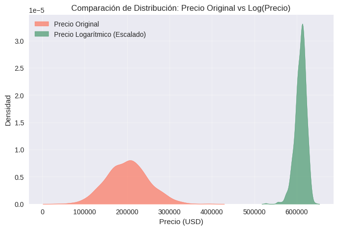
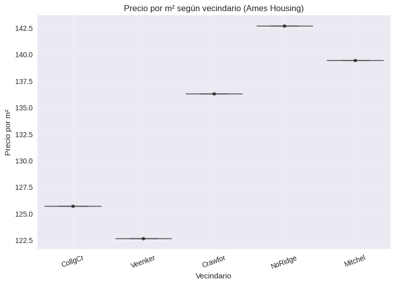
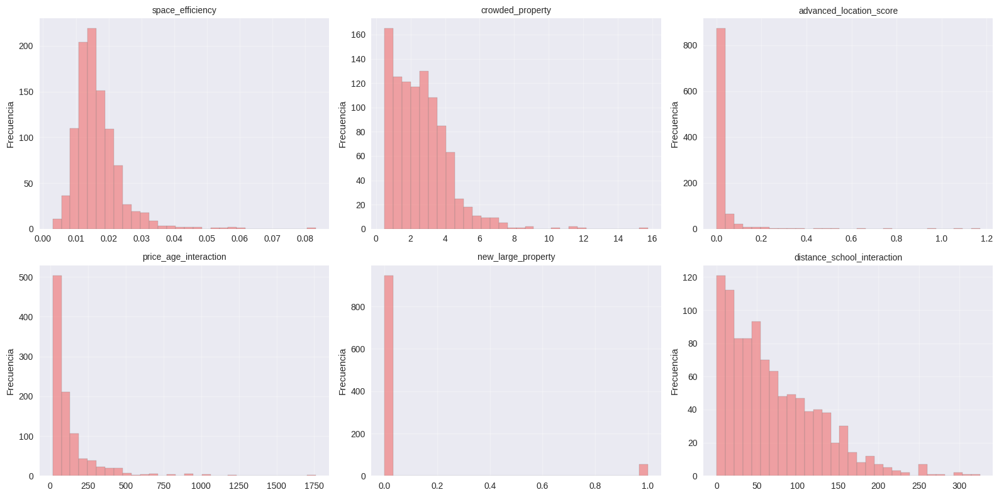
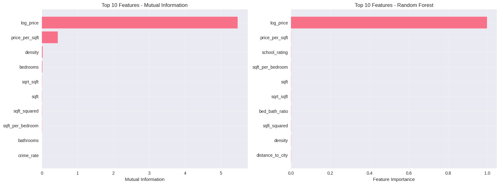
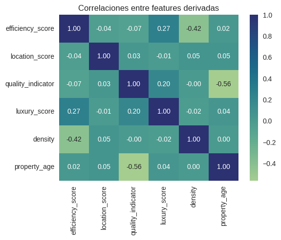
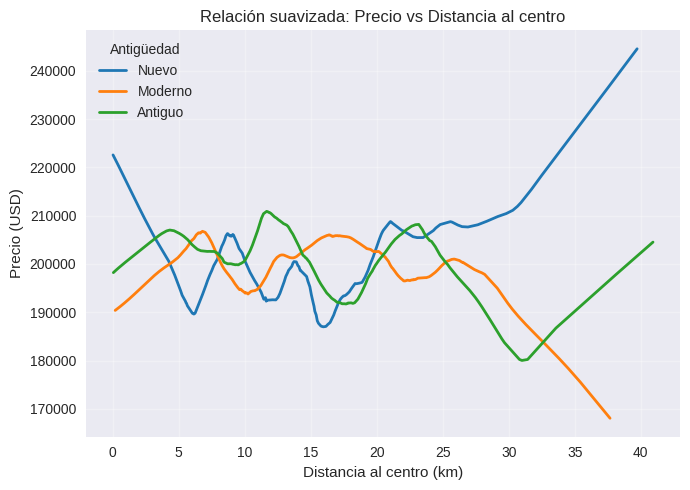

## Contexto
Esta práctica se enfoca en el proceso de **feature engineering** aplicado a un caso de negocio inmobiliario.  
El objetivo es comprender cómo la creación de **nuevas variables derivadas e interacciones** mejora la capacidad predictiva de los modelos de precios de vivienda, utilizando primero un **dataset sintético** y luego validando los resultados con una muestra reducida del dataset real **Ames Housing**.  

El enfoque combina la **experimentación técnica** con el **conocimiento del dominio**, demostrando que el diseño de variables relevantes puede transformar datos estructurales simples en información estratégica **capaz de optimizar decisiones de valuación y predicción en el mercado inmobiliario.**

---

## Objetivos  
- Aplicar un flujo completo de **feature engineering** con datos simulados y reales.  
- Generar nuevas **features derivadas** y de **interacción** que representen comportamientos reales del mercado inmobiliario.  
- Analizar la **distribución, correlación e importancia** de las nuevas variables.  
- Evaluar el impacto predictivo de las features mediante métricas estadísticas y modelos de *machine learning*, validando los resultados con una muestra del dataset **Ames Housing**.

---

## Actividades  

La práctica comenzó con la preparación del entorno en Google Colab y la carga de las librerías necesarias (`pandas`, `numpy`, `matplotlib`, `seaborn`, `sklearn`). Para facilitar la experimentación, se construyó primero un **dataset sintético de viviendas**, incorporando variables como superficie, precio, cantidad de habitaciones, baños, tamaño del lote, año de construcción, distancia al centro, rating escolar, criminalidad y garaje. Este enfoque permitió probar transformaciones de forma controlada antes de pasar a datos reales.

Sobre esta base se desarrolló un conjunto amplio de **features derivadas** vinculadas a eficiencia del espacio, escalas y proporciones: `price_per_sqft`, `log_price`, `sqft_per_bedroom`, `density`, `bed_bath_ratio`, `price_per_bedroom`, `lot_coverage`, `bedrooms_per_1000sqft`, junto con variables temporales como `property_age`, `age_category`, `is_new_property` y `decade_built`. Estas transformaciones permitieron capturar patrones estructurales asociados al espacio disponible, la distribución interna y la antigüedad de las propiedades.

Luego se realizó un **análisis de distribución y correlaciones**, donde se identificaron relaciones clave consistentes con las visualizaciones obtenidas:  
- una correlación negativa entre eficiencia espacial y densidad interna (`efficiency_score` vs `density` = -0.42),  
- una correlación negativa entre calidad percibida y antigüedad de la vivienda (`quality_indicator` vs `property_age` = -0.56).  

También se exploraron relaciones entre precio, superficie, antigüedad y distancia al centro, evidenciando diferencias esperables entre viviendas nuevas, modernas y antiguas.

La contribución de cada *feature* se evaluó utilizando **Mutual Information** y **Random Forest Feature Importance**. En ambos casos, las variables más influyentes fueron `log_price` y `price_per_sqft`, seguidas por indicadores de eficiencia y distribución como `density`, `sqft_per_bedroom` y transformaciones matemáticas (`sqrt_sqft`, `sqft_squared`). Estas conclusiones coinciden con los gráficos de importancia generados.

Como parte del componente investigativo, se incorporaron **features de dominio inmobiliario** tales como:
- `space_efficiency` (relación superficie/lote),  
- `crowded_property` (densidad interna),  
- `advanced_location_score` (distancia, rating escolar y criminalidad).  

También se diseñaron **features de interacción**, incluyendo `price_age_interaction`, `new_large_property` y `distance_school_interaction`. Su impacto se evaluó mediante correlaciones, destacándose el caso de `price_age_interaction` (correlación ≈ 0.163), coherente con la idea de que las propiedades nuevas sostienen mejor su precio relativo.

Finalmente, el pipeline completo se aplicó a una muestra del dataset real **Ames Housing**, verificando que las transformaciones fueran consistentes, reproducibles y mantuvieran relevancia predictiva en un contexto más complejo, consolidando un flujo de *feature engineering* robusto y alineado con el caso de negocio.  

---

## Desarrollo  

El desarrollo se llevó a cabo de forma incremental, comenzando con la creación de un entorno controlado para experimentar con distintas estrategias de *feature engineering*.  
El código se estructuró en celdas secuenciales dentro de Google Colab, facilitando la trazabilidad de cada etapa del flujo de trabajo.  

Primero, se construyó un **dataset sintético** para aislar variables y probar transformaciones sin interferencias externas.  
Este enfoque permitió **validar el comportamiento de cada feature en condiciones controladas** antes de incorporar la complejidad de un dataset real.  

Sobre esta base se aplicaron operaciones matemáticas, logarítmicas y proporcionales para crear nuevas variables, priorizando aquellas que representaran relaciones interpretables entre los datos (eficiencia del espacio, densidad habitacional o relación entre antigüedad y precio).  

El análisis estadístico se complementó con visualizaciones generadas en `seaborn` y `matplotlib`, empleadas para inspeccionar distribuciones, correlaciones y presencia de valores atípicos.  
Los cálculos de *Mutual Information* y *Random Forest Feature Importance* se implementaron en `scikit-learn` para cuantificar la relevancia de cada variable y validar la contribución de las features derivadas.  

Finalmente, se abordaron los **Desafíos de creación de nuevas variables**, integrando conocimiento del dominio inmobiliario.  
Cada feature fue diseñada, testeada y evaluada de forma individual antes de incorporarse al conjunto final, consolidando un pipeline iterativo, escalable y consistente con los objetivos del caso.

---

## Evidencias

### Distribución logarítmica del precio  
  
La transformación logarítmica del precio reduce la asimetría de la distribución, generando una forma más cercana a la normal. Esto mejora la estabilidad de los modelos lineales y evita el sesgo hacia propiedades con precios extremos.

### Precio por m² según vecindario  
  
Los vecindarios muestran diferencias marcadas en el precio por metro cuadrado. “NoRidge” y “Mitchel” presentan los valores más altos, lo que refleja la influencia del contexto geográfico sobre el valor de las viviendas.

### Distribuciones de nuevas features derivadas  
  
Las features derivadas como `space_efficiency`, `crowded_property` y `distance_school_interaction` presentan distribuciones asimétricas. Esto sugiere la presencia de propiedades extremas y la necesidad de escalado o transformación antes del modelado.

---

### Importancia de features  
  
Tanto la información mutua como el modelo Random Forest destacan `log_price` y `price_per_sqft` como las variables más influyentes. Esto valida su peso en la predicción y sugiere una relación no lineal con la variable objetivo.

### Correlaciones entre features derivadas  
  
Se observa correlación moderada negativa entre `quality_indicator` y `property_age`, lo cual indica que las propiedades más antiguas tienden a tener menor calidad percibida. Las demás variables mantienen independencia relativa, útil para evitar multicolinealidad.

### Relación suavizada: Precio vs Distancia al centro  
  
Las viviendas nuevas muestran precios más altos en todas las distancias, mientras que las antiguas pierden valor conforme se alejan del centro urbano. Esta tendencia respalda la relevancia de la variable `distance_to_city` como factor de ubicación.

---

## Insights clave  

- El **feature engineering transforma datos básicos en conocimiento aplicable**, mejorando la capacidad predictiva y explicativa.  
- Las variables **de dominio** aportan valor añadido al incorporar aspectos contextuales (ubicación, antigüedad, eficiencia).  
- `log_price` y `price_per_sqft` se consolidaron como **indicadores robustos del valor real del inmueble**.  
- Las correlaciones entre edad, calidad y eficiencia refuerzan la relación entre modernización y valorización.  
- El proceso demostró que integrar razonamiento técnico y conocimiento de negocio **potencia la capacidad interpretativa de los modelos**.

---

## Reflexión
Esta práctica confirmó que el valor de los datos **no reside en su forma original, sino en cómo se transforman para revelar conocimiento útil**.  
El **feature engineering** se consolida como una de las etapas más críticas del flujo de ciencia de datos, donde confluyen **creatividad, rigurosidad estadística e interpretabilidad**.  

Diseñar nuevas variables con base en sentido del negocio y evidencia empírica permite **incrementar la capacidad predictiva de los modelos** sin sacrificar su transparencia.  
Asimismo, se evidenció que **un exceso de transformaciones puede inducir sobreajuste**, por lo que la selección de features debe fundamentarse en métricas objetivas como *mutual information* y *feature importance*.  

En síntesis, esta práctica permitió comprender que la ingeniería de atributos es tanto un arte como una ciencia: **convierte datos crudos en conocimiento accionable**, y refuerza que el verdadero valor de la ingeniería de datos radica en su capacidad para **convertir complejidad en claridad, y datos en decisiones.**

---

## Notebook en Google Colab  
📓 El notebook completo con el desarrollo de esta práctica puede consultarse en el siguiente enlace:  
[Abrir en Google Colab](https://colab.research.google.com/github/Agustina-Esquibel/Ingenieria-datos/blob/main/docs/UT3/practica8/UT3_Practica_8.ipynb)

---

## 🔗 Referencias  
- [Feature Selection – Scikit-learn Documentation](https://scikit-learn.org/stable/modules/feature_selection.html)  
- [Feature Engineering for Machine Learning – O’Reilly](https://www.oreilly.com/library/view/hands-on-machine-learning/9781098125967/)  

---

## Navegación  
⬅️ [Volver a Unidad Temática 3](../main.md)  
➡️ [Codificando la realidad: cómo el encoding categórico mejora la predicción de ingresos en datos del censo](../practica9/main9.md)  
📓 [Índice del Portafolio](../../portfolio/index.md)
