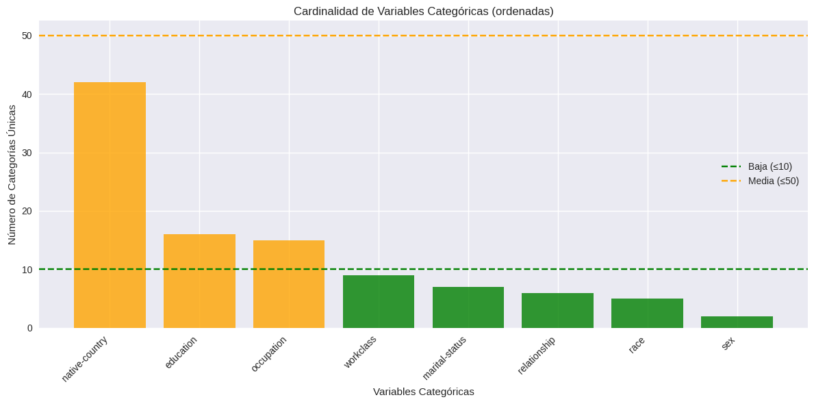
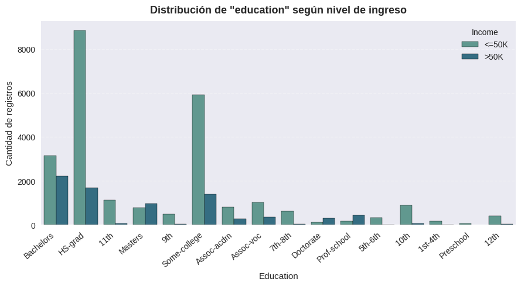
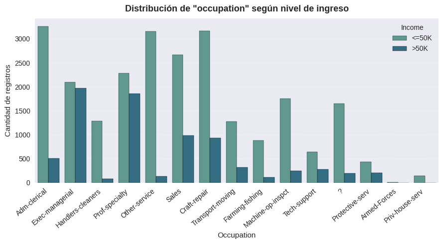
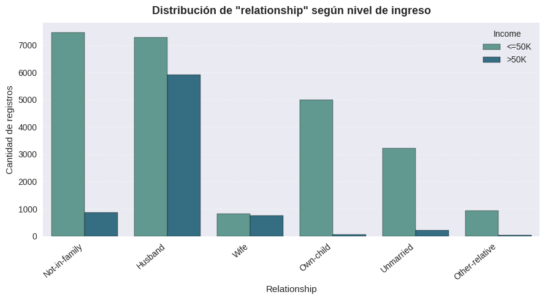
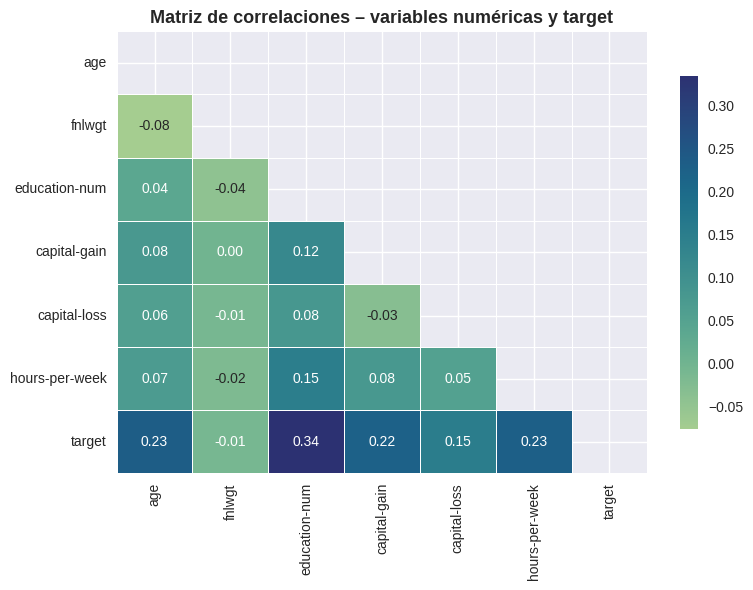
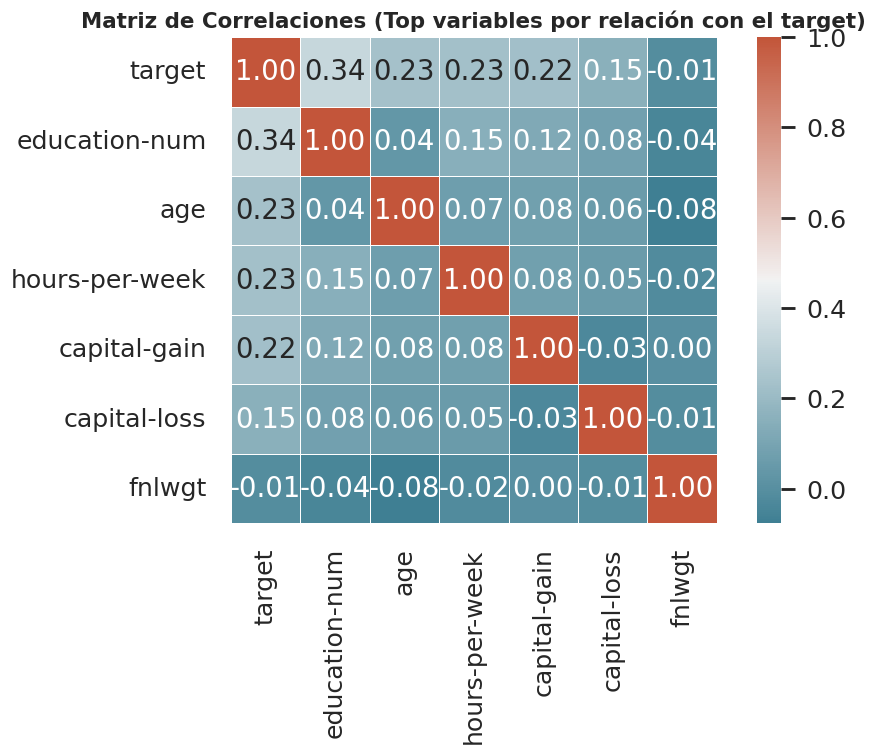
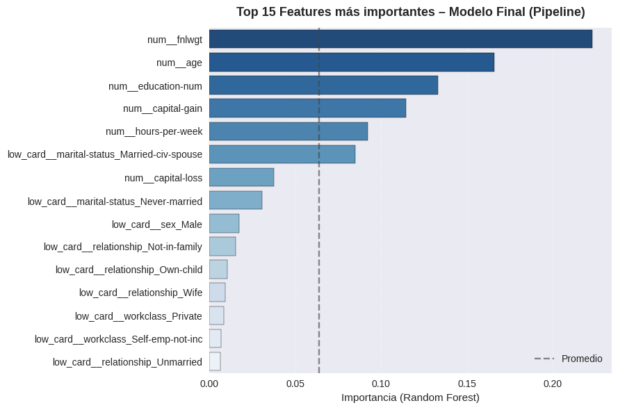
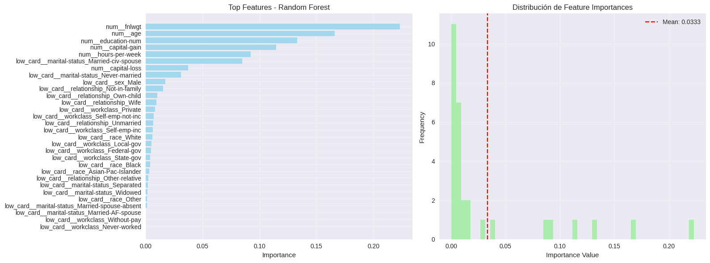
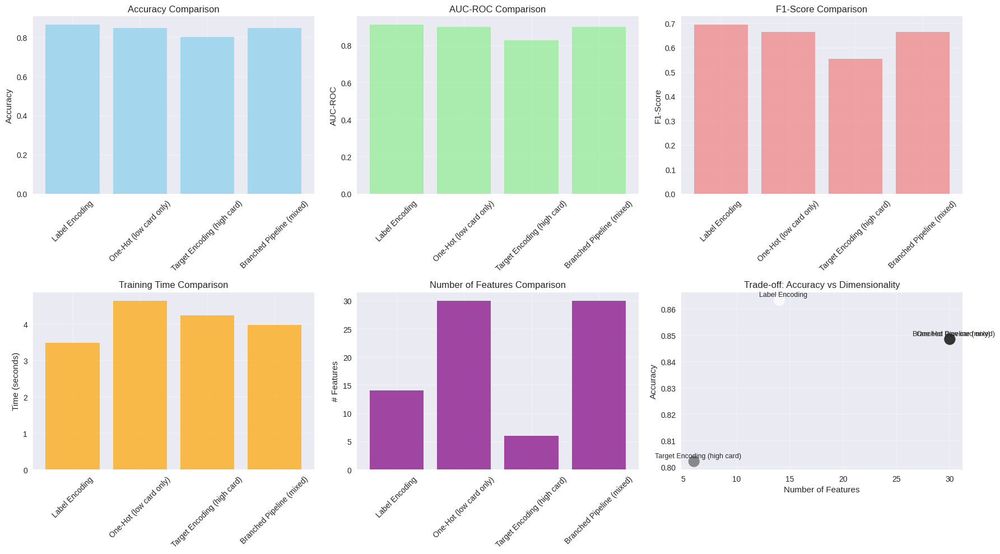

## Contexto  
Esta práctica aborda el proceso de **codificación avanzada de variables categóricas** dentro del flujo de *machine learning*, utilizando el clásico **Adult Income Dataset** del Censo de Estados Unidos (1994), con más de 48.000 registros.  
El objetivo del caso es **predecir si una persona percibe ingresos superiores a 50.000 dólares anuales**, a partir de variables demográficas y laborales que incluyen educación, ocupación, país de origen y estado civil.  

El desafío central radica en la **alta cardinalidad** de ciertas variables categóricas (como `occupation` y `native-country`), que impiden el uso directo de técnicas simples como *one-hot encoding* sin incrementar drásticamente la dimensionalidad del conjunto de datos.  
Por ello, se implementan y comparan múltiples estrategias de codificación —*Label Encoding*, *One-Hot Encoding* y *Target Encoding*— evaluando su impacto en la **precisión, interpretabilidad y eficiencia del modelo de clasificación**.  

La práctica se desarrolla bajo la metodología **CRISP-DM**, con especial énfasis en la fase de *Data Preparation* y su influencia directa sobre los resultados del modelo predictivo.

---

## Objetivos  
- Analizar la **cardinalidad** de las variables categóricas y clasificarlas según su complejidad.  
- Implementar y comparar múltiples técnicas de **encoding** (Label, One-Hot, Target).  
- Prevenir **data leakage** mediante el uso de *cross-validation* en el *target encoding*.  
- Diseñar **pipelines escalables** utilizando `ColumnTransformer` y *branching*.  
- Evaluar el impacto de cada método sobre la **precisión, dimensionalidad y tiempo de entrenamiento**.  
- Documentar los resultados y reflexionar sobre los **trade-offs entre interpretabilidad y performance**.

---

## Actividades  

1. **Instalación de dependencias y configuración del entorno**  
   - Configuración de Google Colab e instalación de librerías (`pandas`, `numpy`, `seaborn`, `category_encoders`, `scikit-learn`, `shap`).  

2. **Carga y exploración del dataset real – Adult Income (Census)**  
   - Análisis inicial del conjunto de datos y revisión de las variables categóricas.  
   - Identificación de variables con **alta cardinalidad** (`occupation`: 15 valores, `native-country`: 42 valores).  

3. **Experimento 1 – Label Encoding**  
   - Aplicación del *LabelEncoder* sobre variables categóricas.  
   - Evaluación del modelo de clasificación (*Logistic Regression*) y registro de métricas de precisión y recall.  
   - Observación: pérdida de interpretabilidad y posible introducción de relaciones ordinales artificiales.  

4. **Experimento 2 – One-Hot Encoding (baja cardinalidad)**  
   - Implementación del *OneHotEncoder* sobre variables con menos de 10 categorías.  
   - Reducción parcial de dimensionalidad mediante *ColumnTransformer*.  
   - Ventaja: alta interpretabilidad. Desventaja: incremento significativo en el número de columnas.  

5. **Experimento 3 – Target Encoding (alta cardinalidad)**  
   - Aplicación de *TargetEncoder* de `category_encoders`, con validación cruzada para evitar *data leakage*.  
   - Cálculo de suavizado (*smoothing*) para mitigar el sobreajuste.  
   - Resultados: mejora en la precisión sin penalizar la eficiencia del modelo.  

6. **Pipeline con Branching – ColumnTransformer**  
   - Construcción de un *pipeline híbrido* combinando las tres estrategias de encoding según la cardinalidad.  
   - Uso de *branching* para aplicar técnicas diferentes en paralelo dentro del mismo flujo de entrenamiento.  

7. **Explicabilidad – Feature Importance y SHAP**  
   - Estimación de la importancia de variables con `RandomForestClassifier`.  
   - Interpretación de contribuciones locales mediante *SHAP values*, comprobando el peso relativo de variables transformadas.  

8. **Comparación de resultados y trade-offs**  
   - Comparación de métricas entre métodos: precisión, F1-score y tiempo de entrenamiento.  
   - Discusión de los *trade-offs* entre complejidad, interpretabilidad y rendimiento.  

9. **Investigación libre – Técnicas adicionales**  
   - Implementación de *Frequency Encoding* y *Ordinal Encoding* como variantes complementarias.  
   - Análisis del impacto marginal de estas técnicas en modelos de árboles y regresión logística.  

---

## Desarrollo  

El desarrollo siguió un enfoque experimental progresivo basado en la comparación empírica de métodos de codificación.  
El trabajo comenzó con la **exploración de cardinalidad** y el análisis de distribución de categorías, lo que permitió clasificar las variables según su nivel de complejidad y definir una estrategia diferenciada para cada grupo.  

A partir de allí, se diseñaron tres experimentos independientes (Label, One-Hot y Target Encoding) bajo un esquema controlado, utilizando las mismas métricas, modelo base y división de datos para asegurar una comparación justa.  
Cada pipeline fue implementado dentro de un `ColumnTransformer`, lo que permitió **modularizar las transformaciones** y mantener un flujo reproducible.  

En el caso del *Target Encoding*, se aplicó validación cruzada (*KFold*) para prevenir fugas de información entre conjuntos de entrenamiento y validación.  
El parámetro de *smoothing* se calibró para equilibrar la estabilidad de las medias y la variabilidad de las categorías menos frecuentes.  

Finalmente, los resultados de cada técnica fueron integrados y analizados con herramientas de interpretabilidad (*feature importance* y *SHAP*), lo que permitió cuantificar el efecto del encoding sobre la relevancia y comportamiento de las variables dentro del modelo.  
El pipeline resultante demostró la importancia de **elegir la técnica adecuada según la naturaleza de cada variable**, optimizando así la precisión sin comprometer la escalabilidad ni la claridad del modelo.

---

## Evidencias  
## 📊 Evidencias Visuales

### 🔹 Cardinalidad de Variables Categóricas
  
Se visualiza la cantidad de categorías únicas por variable, base para definir qué variables se tratan con One-Hot Encoding (baja cardinalidad) y cuáles requieren Target Encoding (alta cardinalidad).

### 🔹 Distribución de Education según nivel de ingreso
  
Permite observar la relación entre nivel educativo y probabilidad de superar los $50K, destacando la diferencia entre niveles secundarios y universitarios.

### 🔹 Distribución de Occupation según nivel de ingreso
  
Muestra las ocupaciones más asociadas con ingresos altos, destacando la brecha entre categorías profesionales y de servicio.

### 🔹 Distribución de Relationship según nivel de ingreso
  
Comparación de tipos de relación familiar frente al nivel de ingreso, evidenciando patrones significativos en el grupo “Husband”.

### 🔹 Matriz de Correlaciones – Variables numéricas y target
  
Correlaciones entre variables numéricas y la variable objetivo; se destacan `education-num`, `age` y `capital-gain` como las más relevantes.

### 🔹 Matriz de Correlaciones (Top variables por relación con el target)
  
Refina el análisis mostrando solo las variables con mayor peso predictivo sobre el target, útil para priorizar en la etapa de feature selection.

### 🔹 Importancia de Features – Modelo Final
  
Ranking de las 15 variables más influyentes según el modelo final (Random Forest con pipeline), señalando la relevancia de `fnlwgt`, `age` y `education-num`.

### 🔹 Importancia y Distribución de Features
  
Comparación entre la importancia media y la dispersión de variables en el modelo, identificando las que aportan más valor explicativo.

### 🔹 Comparación de Modelos y Codificación
  
Comparación global entre Label, One-Hot, Target y Pipeline mixto en métricas de Accuracy, AUC-ROC, F1, tiempo de entrenamiento y dimensionalidad.  
Evidencia que el enfoque mixto logra el mejor equilibrio entre precisión y eficiencia.

### Interpretación General

El análisis visual permite comprender cómo las variables numéricas y categóricas influyen en el nivel de ingresos de las personas según el Censo de EE.UU. (1994).  
Se observa que **edad, educación y capital-gain** son los predictores más relevantes, mientras que las variables categóricas como **ocupación, estado civil y relación familiar** también aportan poder explicativo significativo tras aplicar técnicas de codificación adecuadas.

El uso combinado de **One-Hot Encoding** para variables de baja cardinalidad y **Target Encoding** para las de alta cardinalidad permitió reducir la dimensionalidad sin perder desempeño.  
El modelo final logró un equilibrio entre **precisión y eficiencia**, demostrando la importancia de un diseño de pipeline estratégico para datos reales con gran diversidad de categorías.

---

## Insights clave  

- El *feature encoding* es una etapa determinante para la **eficiencia y generalización** del modelo.  
- El *Label Encoding* resulta adecuado solo para algoritmos basados en árboles, donde la jerarquía numérica no induce sesgos.  
- El *One-Hot Encoding* mantiene interpretabilidad, pero **penaliza la dimensionalidad**, especialmente en variables con alta cardinalidad.  
- El *Target Encoding*, correctamente implementado con *cross-validation*, logra **mejor precisión y estabilidad**, evitando fugas de información.  
- Los *pipelines híbridos* permiten integrar múltiples métodos según la naturaleza de las variables, optimizando la relación entre complejidad y desempeño.  
- Las métricas obtenidas y el análisis con *SHAP* demostraron que la codificación influye directamente en la **importancia relativa de las variables** y en la transparencia del modelo.

---

## Reflexión  

Esta práctica permitió comprender el **rol crítico del encoding categórico** como puente entre los datos reales y la capacidad predictiva de los modelos.  
El proceso evidenció que la calidad de la representación de las variables categóricas **determina en gran medida la precisión, la interpretabilidad y la eficiencia computacional** del modelo final.  

La comparación de técnicas mostró que no existe un método universalmente superior: cada enfoque presenta **trade-offs específicos** entre complejidad, escalabilidad y robustez.  
El *Target Encoding* se destacó por su balance entre poder predictivo y control de dimensionalidad, siempre que se aplique con mecanismos de validación que eviten *data leakage*.  

Desde una perspectiva de ingeniería de datos, la práctica reafirma que **las decisiones tomadas en la etapa de preparación son tan importantes como la elección del modelo en sí**, y que un pipeline bien diseñado puede marcar la diferencia entre un modelo funcional y uno verdaderamente confiable.  

En síntesis, el *feature encoding* se consolida como una fase estratégica del proceso analítico: **transforma la información categórica del mundo real en representaciones matemáticas que los algoritmos pueden entender, sin perder su significado original.**

---

## Notebook en Google Colab  
📓 El notebook completo con el desarrollo de esta práctica puede consultarse en el siguiente enlace:  
[Abrir en Google Colab](https://colab.research.google.com/github/Agustina-Esquibel/Ingenieria-datos/blob/main/docs/UT3/practica9/UT3_Practica9.ipynb)

---

## 🔗 Referencias oficiales  
- [Category Encoders Library](https://contrib.scikit-learn.org/category_encoders/)  
- [Scikit-learn Preprocessing Documentation](https://scikit-learn.org/stable/modules/preprocessing.html)  
- [Feature Engineering for Machine Learning – O’Reilly, Cap. 5](https://www.oreilly.com/library/view/hands-on-machine-learning/9781098125967/)  
- [Kaggle Feature Engineering – Target Encoding Guide](https://www.kaggle.com/code/ryanholbrook/target-encoding)  

---

## Navegación  
⬅️ [Volver a Práctica 8](../practica8/main8.md)  
➡️ [Ir a Práctica 10](../practica10/main10.md)  
📓 [Índice del Portafolio](../../portfolio/index.md)
