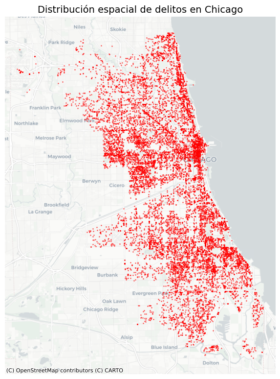
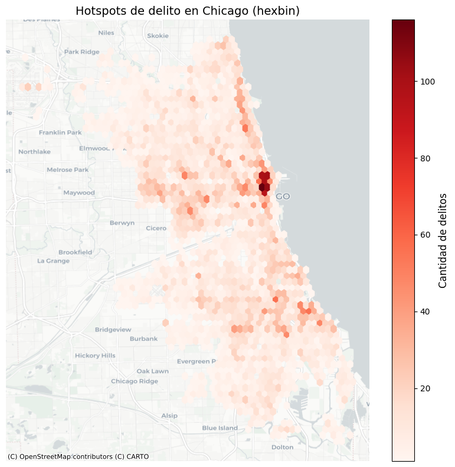
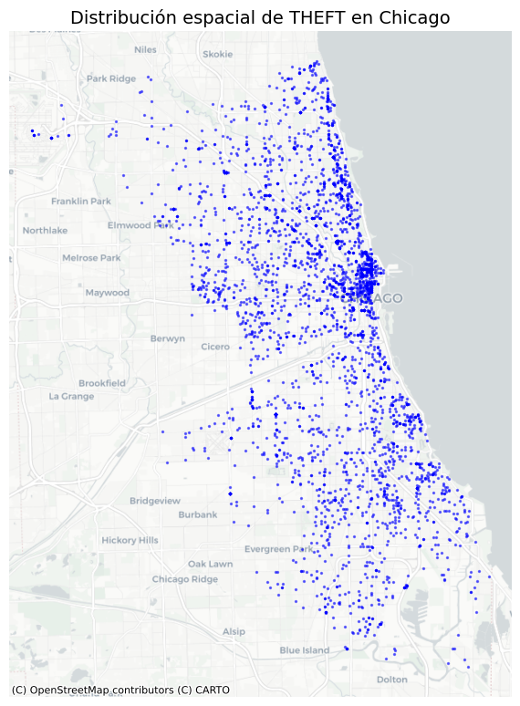
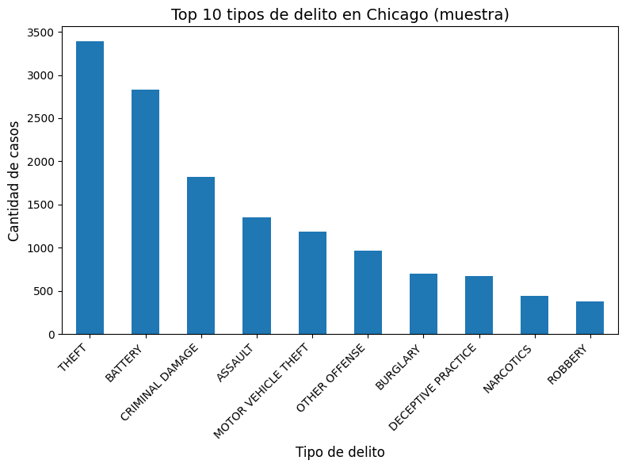

## Contexto

Este caso extra de la UT4 profundiza en el uso de **datos especiales**, incorporando análisis geoespacial real aplicado a registros de delitos de la ciudad de Chicago. El objetivo fue construir un pipeline reproducible capaz de acceder a datos abiertos mediante API, transformarlos en información geográfica y generar visualizaciones que revelen patrones espaciales relevantes para seguridad urbana y toma de decisiones.

El ejercicio integra conceptos de **GeoPandas, Shapely y Contextily**, abordando desde la limpieza y proyección de datos hasta la construcción de mapas de puntos y *hotspots* basados en densidad. A diferencia de las prácticas anteriores, este caso trabaja con datos reales, sin necesidad de subir archivos, demostrando una forma moderna de consumir fuentes abiertas desde Colab.

---

## Objetivos

- Acceder a datos del portal oficial de Chicago mediante API.  
- Convertir datos tabulares en un **GeoDataFrame** con geometrías válidas.  
- Comprender el rol del **CRS (Coordinate Reference System)** y la reproyección a Web Mercator.  
- Construir visualizaciones espaciales interpretables:  
  - distribución de puntos,  
  - mapas de densidad tipo *hexbin*,  
  - vistas filtradas por tipo de delito.  
- Analizar si existen patrones urbanos significativos vinculados a zonas de mayor concentración delictiva.  
- Integrar un pipeline totalmente reproducible en Google Colab sin uso de archivos locales.

---

## Desarrollo del caso

El trabajo se estructuró en cuatro etapas, siguiendo un flujo claro de procesamiento geoespacial.

### 1. Descarga de datos reales vía API

Se utilizó el recurso abierto *Crimes in Chicago*, solicitando una muestra reciente de 15.000 registros. Cada entrada incluye:

- Tipo de delito  
- Coordenadas (latitud/longitud)  
- Fecha  
- Cuadrante o bloque aproximado  

El uso de API aporta dos ventajas:

1. El dataset siempre está actualizado.  
2. Evita subir archivos, manteniendo el notebook liviano y portable.

Los primeros registros evidencian variabilidad en delitos como THEFT, ASSAULT, BURGLARY y DAMAGE.

---

### 2. Limpieza y validación de coordenadas

Antes de la conversión geoespacial, se eliminaron entradas sin latitud o longitud.  
Esto es crucial para evitar geometrías nulas que impedirían la creación de mapas.

La muestra final quedó con **14.933 registros válidos**.

Se reindexó el dataframe para asegurar compatibilidad con GeoPandas.

---

### 3. Conversión a datos geoespaciales y reproyección

Se generó un **GeoDataFrame** asignando a cada incidente un objeto `Point(longitude, latitude)` bajo el CRS **EPSG:4326** (coordenadas geográficas estándar).

Luego, se reproyectó todo a **EPSG:3857 (Web Mercator)**, requerido por los mapas base (CartoDB Positron) para poder superponer puntos correctamente.

Este paso permite:

- coherencia de escala,  
- alineación con mapas digitales modernos,  
- precisión en visualizaciones urbanas.

---

### 4. Visualizaciones espaciales del fenómeno delictivo

Se elaboraron visualizaciones principales, cada una aportando una perspectiva distinta sobre el comportamiento urbano de los delitos.

---

## Evidencias

### Distribución espacial de delitos en Chicago  

Esta visualización revela:

- fuerte concentración de incidentes en la zona costera noreste,  
- dispersión gradual hacia el sur y oeste,  
- patrones asociados a densidad poblacional y corredores de movilidad.

---

### Hotspots de delito mediante hexbin  

El mapa hexagonal permite detectar áreas críticas donde se acumulan muchos eventos.  
Obsérvese cómo:

- un hotspot dominante aparece cerca del distrito central,  
- surgen focos secundarios hacia el sur,  
- las áreas suburbanas muestran baja densidad relativa.

Los hexbin ayudan a suavizar ruido y resaltar tendencias más estables.

---

### Distribución espacial de THEFT  

THEFT es uno de los delitos más frecuentes y se observa:

- alta concentración en zonas comerciales,  
- densidad marcada en espacios con tránsito de personas,  
- distribución más uniforme comparada con otros tipos de delito.

---

### Top 10 tipos de delito  

El conteo revela que:

- THEFT, BATTERY y CRIMINAL DAMAGE dominan la muestra,  
- delitos violentos (ASSAULT) también están presentes con fuerza,  
- la distribución ayuda a interpretar por qué ciertos delitos generan patrones geográficos distintos.

---

## Insights clave

- Los delitos no se distribuyen al azar: siguen la estructura urbana.  
- THEFT y BATTERY muestran patrones espaciales muy marcados cerca del centro.  
- El hexbin evidencia zonas críticas que no se aprecian con mapas de puntos.  
- La reproyección a EPSG:3857 es esencial para mapas profesionales con basemaps.  
- El pipeline permite escalar fácilmente a análisis temporales o clustering de zonas inseguras.  
- El caso demuestra cómo datos abiertos pueden servir para entender dinámicas urbanas reales.

---

## Reflexión

Este caso complementario demuestra la potencia del análisis geoespacial en entornos de datos reales.  
La combinación de:

- acceso directo a API,  
- creación de geometrías,  
- reproyección correcta,  
- y visualizaciones urbanas interpretables,

permite transformar datos brutos en conocimiento aplicable para seguridad pública, logística, movilidad o planificación urbana.

La UT4 se consolida así como una unidad crítica para entender cómo trabajar con **datos no estructurados** y cómo integrarlos dentro de flujos de trabajo avanzados de analítica y machine learning.

---

## Notebook en Google Colab

📓 El notebook completo con el desarrollo de esta práctica puede consultarse en el siguiente enlace:

🔗 [**Abrir notebook en Google Colab**](https://colab.research.google.com/github/Agustina-Esquibel/Ingenieria-datos/blob/main/docs/UT4/extraUT4/UT4Extra.ipynb)

---

## Referencias

- GeoPandas Documentation  
- Shapely – Geometry objects  
- Contextily – Basemaps for Python  
- OpenStreetMap contributors  
- Chicago Data Portal – Crimes dataset

---

## Navegación

⬅️ [Volver a Unidad Temática 4](../main.md)  
📓 [Índice del portafolio](../../portfolio/index.md)
