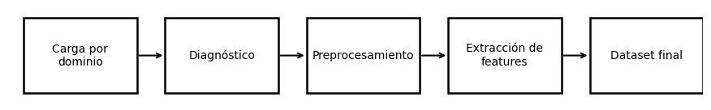

# Unidad Temática 4 – Datos Especiales

En esta unidad se trabajó con **datos no tradicionales**, incorporando técnicas de procesamiento geoespacial, imágenes y audio.  
El objetivo fue construir pipelines capaces de manipular datos complejos, extraer representaciones útiles (features) y preparar insumos reproducibles para tareas de analítica avanzada y machine learning.

## Prácticas realizadas

- [**Geointeligencia urbana: cobertura del SUBTE, densidad poblacional y demanda vecinal en Buenos Aires**](./practica12/main12.md)  
  *Análisis geoespacial utilizando GeoPandas y Shapely para cruzar capas de información urbana y generar visualizaciones que revelan patrones de movilidad.*

- [**Visión computacional aplicada: diagnóstico, contraste y extracción de descriptores con OpenCV**](./practica13/main13.md)  
  *Implementación de un pipeline de preprocesamiento de imágenes (color, contraste, suavizado) y extracción de features con OpenCV para construir descriptores visuales listos para modelado.*

- [**Audio para Machine Learning: limpieza, visualización y extracción de MFCC**](./practica14/main14.md)  
  *Preprocesamiento de señales de audio mediante espectrogramas, normalización y extracción de coeficientes MFCC con Librosa.*

- [**Caso Chicago Crime: cómo los datos geoespaciales revelan la arquitectura oculta del delito urbano**](../UT4/extraUT4/extra4.md)  
Análisis geoespacial aplicado con GeoPandas, Shapely y Contextily para mapear incidentes reales, identificar patrones urbanos, visualizar hotspots y comprender cómo la ubicación condiciona la dinámica delictiva.
  
## Reflexión de la unidad

- **Geoespacial** permitió trabajar por primera vez con datos en formato vectorial, comprendiendo conceptos de CRS, geometrías y overlays para análisis urbano real.  
- **Imágenes** introdujo un flujo estructurado de diagnóstico visual, cambios de espacio de color y extracción automática de descriptores, reforzando la importancia del preprocesamiento antes del modelado.  
- **Audio** presentó un dominio completamente distinto, donde la representación temporal no es suficiente y se requieren transformaciones como MFCC para capturar información perceptual relevante.
- **Chicago Crime** amplió la perspectiva de la unidad al mostrar cómo los datos georreferenciados permiten detectar estructuras urbanas invisibles en tablas tradicionales. El uso de CRS, reproyección y mapas base consolidó la comprensión práctica del análisis espacial como herramienta clave para interpretar fenómenos reales.

En conjunto, la UT4 abrió el panorama hacia **datos no estructurados**, mostrando cómo adaptar pipelines según la naturaleza del dato. Esto fue clave para entender que el análisis no depende solo de Pandas: cada dominio (mapas, imágenes, audio) requiere herramientas propias y criterios específicos de limpieza, representación y documentación.

## Flujo de trabajo de UT4

Este flujo resume el trabajo por dominio en la UT4: cargar datos geoespaciales, de imágenes y audio, diagnosticarlos, preprocesarlos y extraer features específicos para formar un dataset final utilizable.

## Conclusión final de UT4

La UT4 consolidó la capacidad de trabajar con **datos alternativos** y de diseñar pipelines robustos más allá de los tabulares.  
Este dominio complementa el análisis tradicional y prepara el camino para integrar datos geoespaciales, visuales y sonoros dentro de proyectos de IA más complejos y multimodales.

- - -

📓 [Índice del portafolio](../portfolio/index.md)
