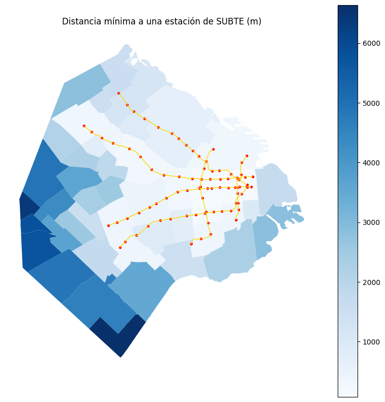
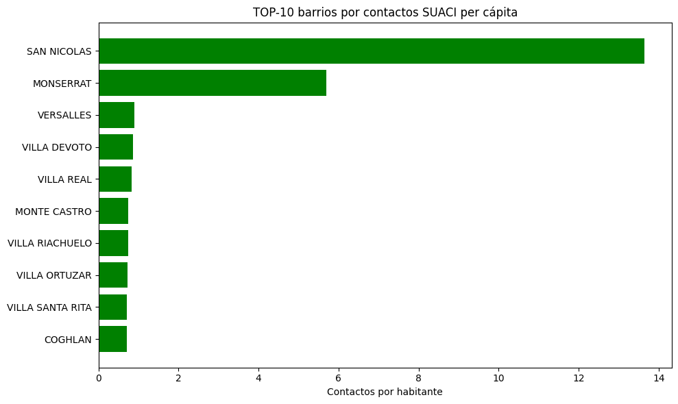
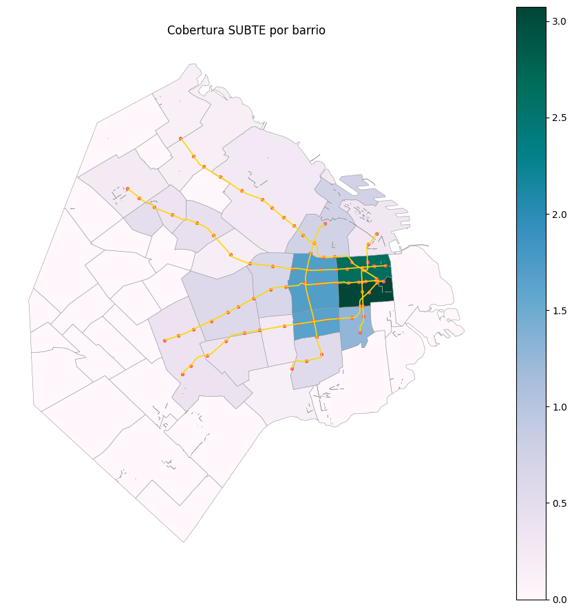
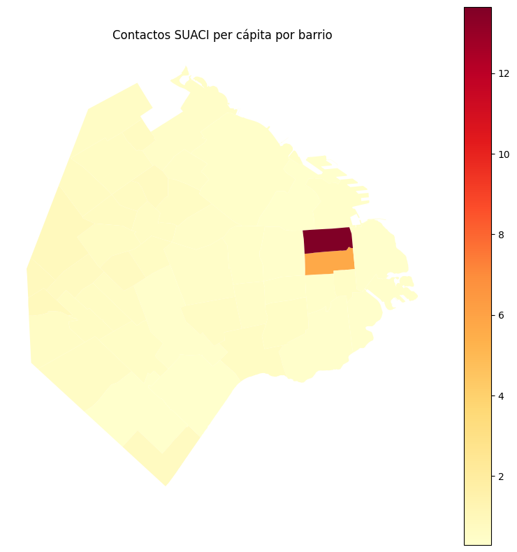
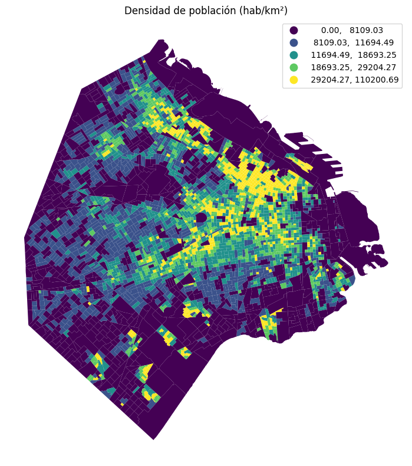
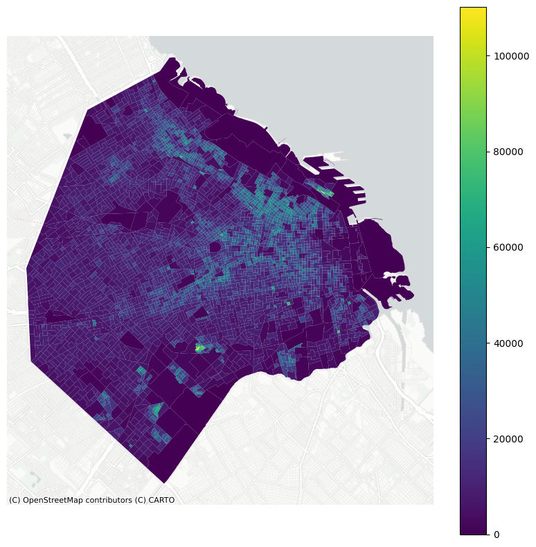
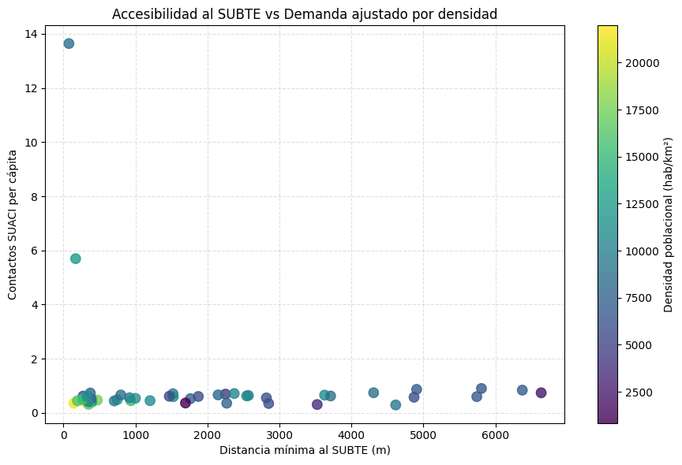

## Contexto
El análisis geoespacial es una herramienta clave para comprender cómo funcionan las ciudades y cómo se distribuyen las oportunidades dentro del territorio.  
En esta práctica se integran tres fuentes esenciales para caracterizar la estructura urbana de CABA:

- Polígonos de **barrios** con población y superficie.
- Líneas y **estaciones del SUBTE** como proxy de accesibilidad.
- Datos de **contactos SUACI** como indicador de demanda y presión vecinal.

El objetivo es analizar cómo interactúan **densidad urbana**, **accesibilidad al SUBTE** y **demanda ciudadana**, construyendo un flujo geoespacial reproducible con GeoPandas que permita fundamentar decisiones urbanas con evidencia territorial.

## Objetivos
- Analizar cómo se distribuye la población y la demanda vecinal en el territorio.  
- Calcular accesibilidad al SUBTE mediante estaciones por km² y distancia mínima.  
- Normalizar la demanda SUACI por habitante para evitar sesgos.  
- Integrar datasets espaciales y tabulares mediante joins y proximidad.  
- Elaborar visualizaciones narrativas orientadas a la toma de decisiones.  
- Comparar metodologías alternativas (distancia Euclidiana vs distancia por red vial).

## Actividades
- Conversión de todas las capas al CRS proyectado **EPSG:5347**.  
- Cálculo de métricas básicas: área real, densidad poblacional y contactos per cápita.  
- Join espacial entre estaciones y barrios (punto–en–polígono).  
- Distancia mínima al SUBTE mediante `sjoin_nearest`.  
- Elaboración de coropletas y visualizaciones comparativas.  
- Análisis crítico entre métricas de distancia (recta vs vial).

---

## Desarrollo

### 1. Preparación de datos y CRS
Todas las capas fueron reproyectadas a **EPSG:5347**, una proyección métrica adecuada para Buenos Aires.  
Con esto, las áreas y distancias se calcularon correctamente en m² y metros.

Se obtuvieron:
- `area_m2` a partir de la geometría.  
- `densidad_hab_km2 = poblacion / (area_m2 / 1e6)`.

Estas métricas permiten comparar barrios de distinto tamaño bajo criterios homogéneos.

### 2. Normalización de la demanda SUACI
Para evitar que los barrios más poblados aparezcan automáticamente como líderes en demanda, se utilizó una métrica ajustada por habitantes.  
La fórmula fue:
```
contactos_pc = contactos_totales / poblacion
```

Esta normalización permitió identificar barrios donde la presión vecinal es realmente alta, independientemente del tamaño de la población.

### 3. Cobertura del SUBTE y accesibilidad territorial
Mediante un join espacial punto-en-polígono se obtuvo:
- `n_estaciones` por barrio.  
- `estaciones_por_km2` como indicador de cobertura.

Luego, con centroides y `sjoin_nearest`, se calculó la **distancia mínima** de cada barrio al SUBTE.  
Este análisis evidenció brechas de accesibilidad en la periferia sur.

### 4. Visualizaciones elaboradas
*(Serán agregadas más adelante en `/assets/UT4/`)*

- Coropleta de densidad poblacional.  
- Coropleta de contactos per cápita.  
- Cobertura del SUBTE por km².  
- Distancia mínima a estaciones.  
- Scatter accesibilidad vs demanda vecinal.

---

## Comparación de métodos: razonamiento crítico

### 🔹 Enfoque 1 — Distancia Euclidiana (implementado)
- Mide la distancia directa entre centroides y estaciones.  
- Es veloz y adecuado para análisis exploratorios.  
- Subestima la accesibilidad real en zonas urbanas complejas.

| Método | Ventaja | Limitación | Complejidad |
|--------|---------|------------|-------------|
| Distancia Euclidiana | Simple y rápida | No considera la red vial | Baja |

---

### 🔹 Enfoque 2 — Distancia por red vial (OSMnx)
- Modela la caminabilidad real usando un grafo de calles.  
- Otorga estimaciones más precisas del acceso al transporte.  
- Tiene mayor costo computacional y requiere más preparación.

| Método | Ventaja | Limitación | Complejidad |
|--------|---------|------------|-------------|
| Red vial (OSMnx) | Alta fidelidad urbana | Mayor preparación/cómputo | Media/Alta |

---

### Conclusión comparativa
Para exploración inicial, reproducibilidad académica y rapidez de cómputo, la **distancia Euclidiana** es suficiente y permite obtener patrones territoriales claros.  
Sin embargo, para planificación urbana, estudios de movilidad o decisiones de infraestructura, la **distancia por red vial** es el método adecuado, ya que representa de forma realista cómo se mueven las personas en la ciudad.  
La elección del método depende del objetivo: **velocidad y exploración** vs. **fidelidad urbana y precisión analítica**.

---

## Evidencias  

### 1. Distancia mínima a una estación de SUBTE (m)


**Análisis:**  
Este mapa cuantifica la accesibilidad física al sistema de transporte subterráneo. Las zonas más oscuras indican barrios que se encuentran a mayores distancias de una estación, revelando **brechas claras de accesibilidad** entre el centro y la periferia.  
El trazado del SUBTE —concentrado en el corredor central— evidencia un patrón urbano histórico que condiciona la movilidad actual. Esta visualización es fundamental para comprender dónde el sistema de transporte deja vacíos territoriales.

---

### 2. TOP-10 barrios por contactos SUACI per cápita


**Análisis:**  
El ranking muestra qué barrios presentan **mayor demanda relativa de servicios ciudadanos**. San Nicolás y Monserrat destacan con amplitud, lo que puede asociarse a:  
- mayor actividad comercial,  
- alta densidad laboral,  
- problemáticas urbanas persistentes que generan interacción con el sistema SUACI.  

Este indicador identifica **zonas críticas de gestión urbana**, permitiendo priorizar recursos administrativos.

---

### 3. Cobertura SUBTE por barrio


**Análisis:**  
La cobertura del SUBTE se concentra fuertemente en el microcentro, mostrando cómo el sistema favorece el eje histórico–administrativo de la ciudad.  
La periferia queda prácticamente desconectada, reforzando un **gradiente centro–periferia** que influye en oportunidades laborales, acceso a servicios y tiempos de viaje. Esta visualización destaca inequidades estructurales en movilidad urbana.

---

### 4. Contactos SUACI per cápita por barrio


**Análisis:**  
Este mapa espacializa la demanda de SUACI por habitante. La concentración extrema en ciertos polígonos señala **zonas con mayor presión cívica**, posiblemente asociadas a infraestructura envejecida, mayor exposición a problemas urbanos o mayor propensión a reportar incidentes.  
El gráfico ayuda a detectar **puntos calientes administrativos**, clave para planificar intervenciones focalizadas.

---

### 5. Densidad poblacional (hab/km²)


**Análisis:**  
La densidad muestra fuertes contrastes: áreas centrales y del corredor norte-este presentan densidades muy elevadas, mientras que otras regiones son más dispersas.  
Este indicador es crítico como variable de control, ya que permite interpretar correctamente patrones de demanda y accesibilidad.  
Una alta densidad no siempre se correlaciona con alta demanda, lo cual se verifica más adelante.

---

### 6. Densidad poblacional (detalle por celdas)


**Análisis:**  
A un nivel más granular, la densidad revela microzonas densamente pobladas que no coinciden necesariamente con los límites barriales.  
Esta resolución fina permite hacer análisis más precisos de **inequidad territorial**, especialmente cuando se combinan con métricas de acceso al SUBTE o niveles de demanda ciudadana.

---

### 7. Accesibilidad al SUBTE vs Demanda ajustado por densidad


**Análisis:**  
Este scatterplot sintetiza tres dimensiones clave:  
- **Distancia al SUBTE** (accesibilidad),  
- **Contactos SUACI per cápita** (demanda),  
- **Densidad poblacional** (color).  

La nube de puntos muestra que **no existe relación lineal evidente entre accesibilidad y demanda**, incluso después de ajustar por densidad. Barrios muy accesibles pueden tener poca demanda, y barrios lejanos pueden presentar valores elevados.  
Esto revela que la demanda ciudadana está influenciada por variables adicionales: características socioeconómicas, antigüedad edilicia, tipo de uso del suelo, nivel de organización vecinal, entre otros.  
Es la visualización más integradora de la práctica, ya que **conecta infraestructura, comportamiento ciudadano y estructura urbana en un único análisis comparativo**.

---

## Insights clave

1. La cobertura del SUBTE se concentra en el eje central de la ciudad.  
2. La normalización cambia completamente la lectura territorial de la demanda vecinal.  
3. La densidad poblacional no predice la demanda SUACI.  
4. La periferia sur presenta las mayores brechas de accesibilidad.  
5. Accesibilidad y presión vecinal son fenómenos complementarios, no equivalentes.

---

## Reflexión
Esta práctica integró análisis geoespacial, normalización de métricas y razonamiento crítico.  
El aprendizaje clave fue comprender cómo las **decisiones metodológicas** (CRS, normalización, elección de métricas) afectan directamente la interpretación de los mapas y los fenómenos urbanos.

La diferencia entre datos absolutos y tasas per cápita, y entre distancia recta y distancia vial, mostró cómo distintas métricas producen lecturas territoriales distintas.  
Documentar estos criterios y mantener un flujo reproducible reforzó buenas prácticas de ingeniería de datos.

En síntesis, esta práctica reafirma que en ingeniería de datos espaciales la técnica define la narrativa del territorio: **cambiar la métrica cambia la historia que contamos sobre la ciudad**, por lo que la transparencia metodológica es esencial.

---

## Notebook en Google Colab

📓 El notebook completo con el desarrollo de esta práctica puede consultarse en el siguiente enlace:


---

## Navegación
⬅️ Volver a Unidad Temática 4  
📓 [Índice del Portafolio](../../portfolio/index.md)
