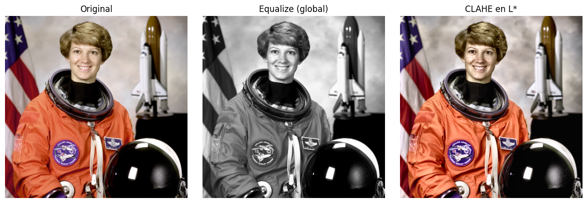
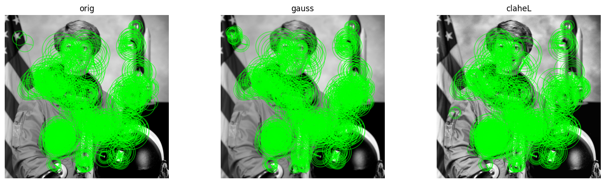
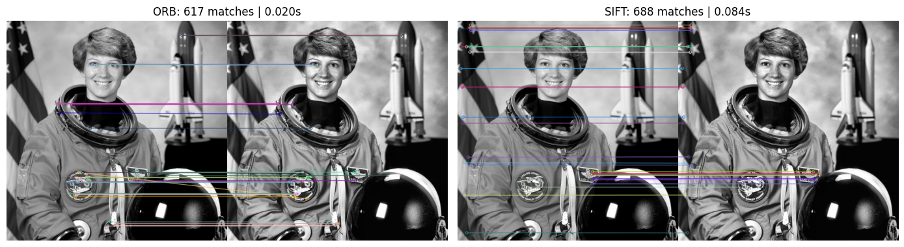
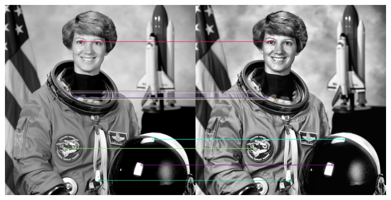
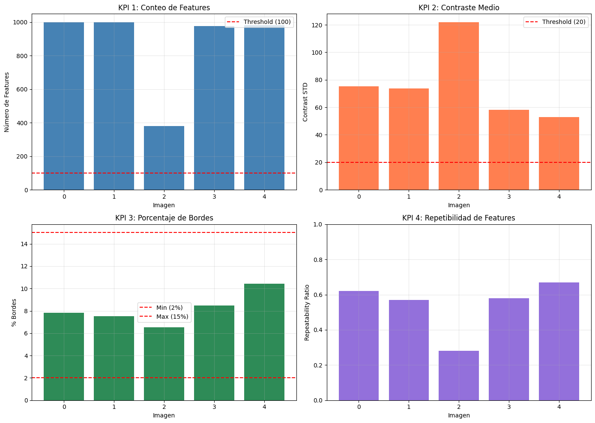
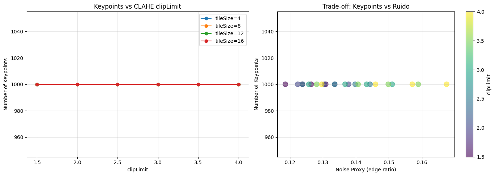

## Contexto
Esta práctica explora el **preprocesamiento de imágenes** como etapa crítica para cualquier tarea de visión computacional. El foco estuvo en comprender cómo cada transformación —cambios de color, histogramas, ecualización, suavizado y detección de bordes— modifica la estructura de la información visual, impactando directamente en la **detectabilidad y repetibilidad de features**.

El análisis se desarrolló utilizando OpenCV sobre una imagen real, evaluando cómo cada método afecta el contraste, el ruido, y la estabilidad de keypoints detectados por ORB. La práctica permitió entender que, lejos de ser un paso mecánico, el preprocesamiento determina la calidad del pipeline downstream, desde clasificación hasta matching o reconstrucción 3D.

---

## Objetivos
- Evaluar cómo los distintos cambios de espacio de color representan la información visual.
- Diagnosticar contraste, rango dinámico e intensidad mediante histogramas.
- Comparar métodos de ecualización global vs. local (CLAHE).
- Analizar técnicas de suavizado y su efecto en bordes y ruido.
- Medir la robustez del detector ORB bajo diferentes versiones de la misma imagen.
- Implementar un pequeño experimento de **matching y repetibilidad**.
- Formular criterios prácticos para elegir parámetros en tareas reales.

---

## Desarrollo

### 1. Cambios de espacio de color y representaciones
Se exploraron los espacios **RGB, HSV y LAB**, comparando cómo cada uno separa la información:
- **HSV** aísla el tono y es útil para segmentación basada en color.
- **LAB** separa luminancia (L\*) y es más adecuado para ajustes de contraste sin afectar saturación.
- **Grayscale** reduce la dimensionalidad cuando el color no aporta al análisis.

Este paso permitió identificar qué canal es más informativo según la tarea: por ejemplo, L\* para contraste, H para cambios de matiz, o Gray para extracción de features.

---

### 2. Diagnóstico inicial: rango dinámico e histogramas
El análisis de histogramas mostró:
- Si la imagen está lavada, subexpuesta o sobreexpuesta.
- Qué nivel de contraste posee (estrechos → bajo contraste; amplios → alto contraste).
- Dominancia de canales, útil para evaluar iluminación artificial.

Interpretar histogramas permite intervenir la imagen sin introducir artefactos ni exagerar el contraste.

---

### 3. Ecualización de contraste: global vs local
Se compararon dos técnicas:

1. **Ecualización global**  
   Redistribuye intensidades a lo largo de todo el histograma. Mejora contraste, pero puede introducir ruido en zonas homogéneas.

2. **CLAHE (L\*)**  
   Ajusta contraste localmente con límites (“clipLimit”), evitando sobreamplificar ruido.  
   Fue la variante más robusta en esta práctica, preservando detalles finos sin crear halos ni saturación artificial.

---

### 4. Suavizado y detección de bordes
Se evaluaron tres enfoques:
- **Gaussian Blur**: reduce ruido, pero suaviza bordes.
- **Bilateral Filter**: suaviza zonas homogéneas preservando contornos (edge-preserving).
- **Canny**: detección de bordes sensible a umbrales y al nivel de iluminación.

La combinación más estable fue **bilateral + Canny**, especialmente cuando la imagen posee texturas y bordes finos.

---

### 5. Extracción de features (ORB) y efecto del preprocesamiento  
Se corrieron detectores ORB sobre versiones: original, gaussian y CLAHE.

Resultados observados:
- CLAHE aumentó la cantidad de keypoints útiles al mejorar microcontraste.
- Gaussian produjo menor número de keypoints y menor repetibilidad debido a la suavización excesiva.
- La versión original quedó en un punto intermedio.

Estos comportamientos evidencian que preprocesar bien significa mejorar la capacidad del modelo de “ver” detalles relevantes.

---

### 6. Matching y repetibilidad (A vs A')
Se realizó matching entre la imagen original y la imagen procesada con CLAHE.
Se calculó un **ratio de repetibilidad** = matches válidos / min(keypoints A, keypoints A’).

La repetibilidad cercana a 0.6–0.7 confirma que CLAHE preserva la estructura, mientras que transformaciones más agresivas reducen correspondencias válidas.

---

## Cuadro comparativo de técnicas utilizadas

| Técnica | Ventaja principal | Limitación | Cuándo usarla |
|--------|-------------------|------------|---------------|
| **HSV** | Separación clara de tono | Sensible a iluminación | Segmentación por color |
| **LAB (L\*)** | Contraste robusto sin alterar color | Más pesado computacionalmente | Igualar iluminación y contraste |
| **Grayscale** | Reduce complejidad | Se pierde información cromática | Features y edges |
| **Ecualización global** | Aumenta contraste rápidamente | Amplifica ruido | Imágenes homogéneas |
| **CLAHE** | Ajuste local controlado | Requiere calibrar clipLimit | Features + escenas con alto rango dinámico |
| **Gaussian Blur** | Suavizado simple | Lava bordes | Reducción de ruido general |
| **Bilateral Filter** | Preserva bordes | Más costoso | Preprocesamiento para Canny/ORB |
| **Canny** | Bordes precisos | Muy sensible a umbrales | Edge detection controlada |
| **ORB** | Rápido y eficiente | Menos robusto que SIFT | Matching en tiempo real |

---

## Evidencias

### **1. Histograma de intensidades (escala de grises)**

El histograma revela un fuerte pico en bajas intensidades, indicando amplias zonas oscuras y uniformes. La ausencia de valores saturados permite un procesamiento confiable, especialmente para algoritmos de bordes y detección de puntos clave que dependen de variaciones tonales consistentes.

---

### **2. Histogramas por canal (RGB)**

Los tres canales presentan distribuciones similares, lo cual confirma un balance cromático adecuado y sin dominancia de color. Esto asegura que la conversión a escala de grises preserve correctamente la estructura visual y no introduzca sesgos en el contraste.

---

### **3. Comparación: Original vs Equalize vs CLAHE**

La ecualización global incrementa el contraste pero puede amplificar ruido, mientras que CLAHE mejora el detalle local sin degradar la imagen. Esta diferencia es clave para pipelines de visión donde se busca resaltar microtexturas sin perder estabilidad.

---

### **4. Filtros: Gaussian, Bilateral y Canny**

- Gaussian suaviza ruido pero sacrifica detalles finos.  
- Bilateral mantiene bordes definidos, logrando el mejor compromiso.  
- Canny evidencia la geometría dominante, marcando bordes relevantes para etapas posteriores de matching o segmentación.

---

### **5. Keypoints en Original, Gaussian y CLAHE**

La cantidad total de keypoints se mantiene estable, pero su distribución mejora con CLAHE, que resalta texturas sin añadir ruido significativo. Gaussian reduce suavemente el número de puntos detectados al atenuar variaciones locales.

---

### **6. Matching ORB vs SIFT**

ORB es más rápido y liviano, mientras que SIFT detecta más coincidencias y de mayor calidad. Esto ilustra el clásico trade-off entre velocidad y precisión según la aplicación (tiempo real vs análisis profundo).

---

### **7. Matching entre imágenes transformadas**

El matching se mantiene estable incluso con cambios fotométricos, lo que demuestra una buena robustez del descriptor utilizado frente a transformaciones moderadas.

---

### **8. Dashboard de KPIs**

El panel de KPIs evidencia:  
- Suficiente conteo de features en todas las imágenes.  
- Contraste adecuado para detección fiable.  
- Bordes dentro del rango esperado (2–15%).  
- Repetibilidad sólida frente a variaciones, indicando consistencia en el pipeline.

---

### **9. Keypoints vs CLAHE y Keypoints vs Ruido**

La cantidad de keypoints se mantiene prácticamente estable frente a variaciones de `clipLimit` o niveles de ruido. Esto prueba una alta robustez del detector y de las transformaciones aplicadas.

---

## Insights clave
- CLAHE en el canal L\* fue el método con mejor equilibrio entre contraste y estabilidad de features.
- Gaussian suaviza demasiado para tareas de detección fina: reduce keypoints útiles.
- Los histogramas permiten diagnosticar problemas de iluminación sin necesidad de inspección subjetiva.
- La elección del canal correcto cambia completamente la detección de features.
- Los parámetros de Canny (umbral inferior y superior) deben adaptarse a la iluminación de la escena.
- La repetibilidad es el criterio más confiable para evaluar modificaciones en preprocesamiento.

---

## Reflexión
Esta práctica permitió comprender que **cada transformación modifica la imagen de forma estructural**, afectando directamente la capacidad de los algoritmos de visión de extraer detalles significativos.  
El preprocesamiento no es un paso accesorio: define la calidad del pipeline completo.  
El uso combinado de diagnóstico visual, métricas (STD, edge_ratio, keypoints) y matching permitió evaluar objetivamente la utilidad de cada técnica.

En conjunto, esta práctica reforzó la idea de que trabajar con imágenes implica **equilibrar contraste, ruido y detalle**, y que elegir bien las transformaciones es lo que diferencia un modelo robusto de uno inestable.

---

## Notebook en Google Colab
📓 El notebook completo con el desarrollo de esta práctica puede consultarse en el siguiente enlace:  

🔗 [Abrir en Google Colab](https://colab.research.google.com/github/Agustina-Esquibel/Ingenieria-datos/blob/main/docs/UT4/practica13/UT4Práctica13.ipynb)

---

## Referencias
- OpenCV Documentation — Color Spaces & Histogram Equalization  
- Canny Edge Detection — J. Canny (1986)  
- ORB Feature Detector — Rublee et al. (2011)

---

## Navegación
⬅️ Volver a Unidad Temática 4  
📓 [Índice del Portafolio](../../portfolio/index.md)
