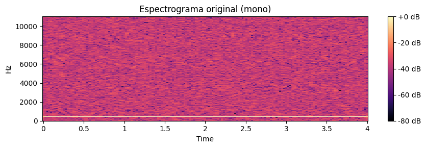
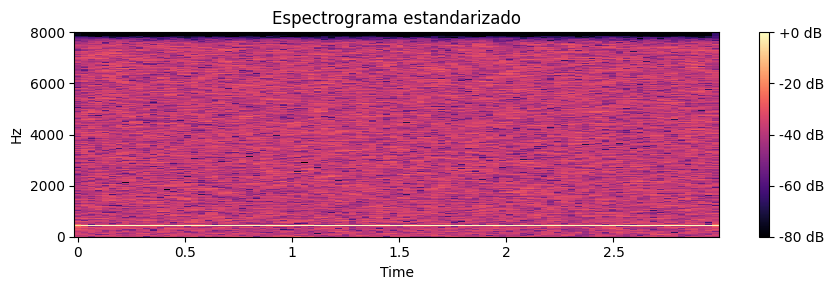
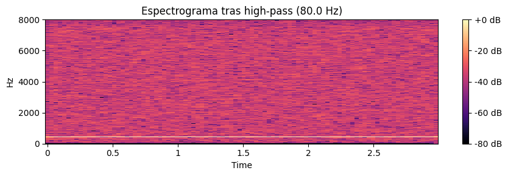
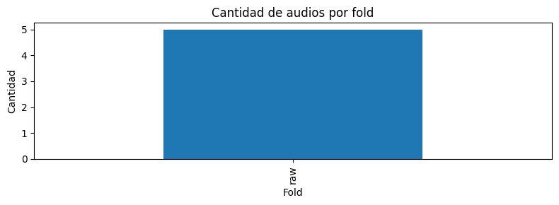
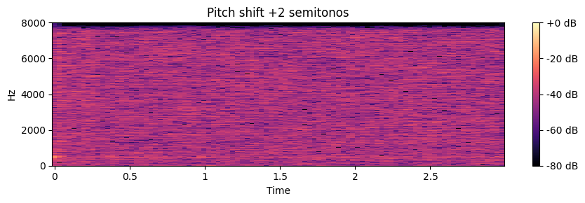
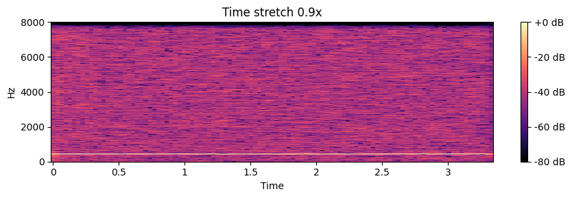
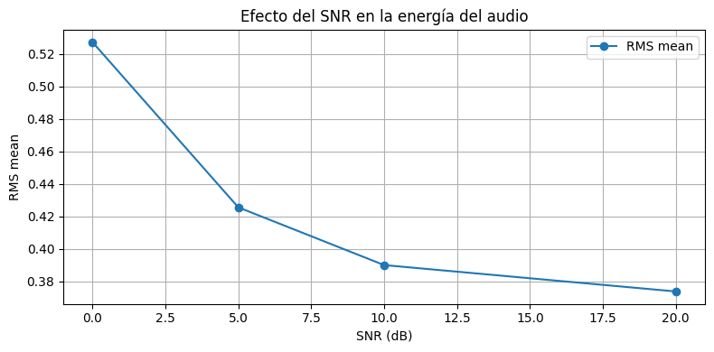
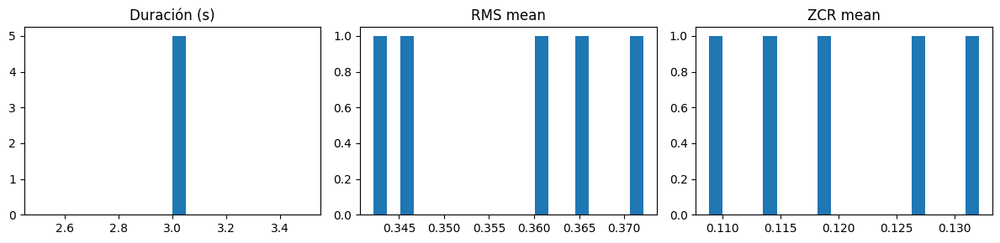

## Contexto
Esta práctica forma parte de la Unidad Temática 4, enfocada en el procesamiento de **datos no tradicionales**, específicamente **audio** como fuente de información.  
El objetivo general es comprender cómo una señal sonora en bruto puede transformarse en una representación numérica útil mediante un pipeline estructurado de **preprocesamiento, visualización, filtrado, augmentación y extracción de features**.

El enfoque combina técnicas de **procesamiento digital de señales** con principios de **feature engineering**, demostrando que la calidad y coherencia del pipeline influyen directamente en la robustez de los futuros modelos de machine learning.

---

## Objetivos
- Construir un pipeline reproducible de **preprocesamiento de audio** utilizando `librosa`, `numpy`, `matplotlib` y `scipy`.
- Analizar la señal en el **dominio temporal** (waveform) y en el **dominio frecuencial** (espectrograma).
- Aplicar transformaciones que mejoran la calidad de la señal: **estandarización, ruido controlado, filtrado high-pass**.
- Calcular **métricas espectrales dinámicas** (centroid, rolloff, bandwidth).
- Implementar **data augmentation** mediante *pitch shift* y *time stretching*.
- Extraer **MFCC** y generar un archivo **CSV de features** apto para modelos supervisados.

---

## Desarrollo

### 1. Carga y estandarización del audio
El estudiante cargó los clips WAV utilizando `librosa.load`, aplicando dos configuraciones clave:

- **Resampleo a 16 kHz**, frecuencia suficiente para voz y sonidos urbanos, que además reduce tamaño y estandariza los clips.
- **Conversión a mono**, simplificando el análisis y evitando duplicación de información estereofónica irrelevante para este contexto.

Posteriormente se graficó la **forma de onda** y se aplicó una **estandarización z-score**, centrando la señal en cero y homogeneizando la escala para evitar que diferencias de volumen afecten el análisis o el rendimiento de futuros modelos.

---

### 2. Espectrograma de potencia
Se implementó una función personalizada para calcular espectrogramas utilizando STFT con:

- `n_fft = 2048`  
- `hop_length = 512`

Estos parámetros equilibran la resolución temporal y frecuencial, adecuados para análisis exploratorio.

Se compararon espectrogramas del **audio original** y del **audio estandarizado**, verificando que la estructura espectral se conserva mientras la escala se normaliza.

---

### 3. Ruido y relación señal-ruido (SNR)
Se añadió **ruido blanco** con SNR = **10 dB** para simular condiciones reales de grabación (ambientes urbanos, micrófonos móviles) y observar cómo cambia la representación espectral bajo ruido controlado.

Esta etapa permitió evaluar la robustez de la señal y analizar qué estructuras del audio permanecen visibles aún con interferencia significativa.

---

### 4. Filtrado High-Pass
Se aplicó un filtro **Butterworth de orden 4** con corte en **80 Hz** para eliminar componentes graves no informativos.

El espectrograma posterior mostró una reducción marcada de energía en bajas frecuencias, confirmando que el filtrado retira ruido sin comprometer información relevante para tareas de clasificación.

---

### 5. Métricas espectrales adicionales
Se calcularon las métricas:

- **Spectral centroid**  
- **Spectral rolloff (p85)**  
- **Spectral bandwidth**

Estas series temporales ofrecen una representación compacta del comportamiento espectral, permitiendo detectar variaciones en brillo, distribución de energía y amplitud de banda a lo largo del tiempo.

---

### 6. Análisis del dataset
Se generó un gráfico que muestra la **cantidad de audios por fold**, lo cual permitió identificar desbalances en la distribución del dataset.

Estos desbalances son relevantes para modelado posterior, ya que pueden requerir estrategias de compensación o augmentación adicional.

---

### 7. Data Augmentation
Se aplicaron dos técnicas:

- **Pitch shift (+2 semitonos)**  
- **Time stretching (0.9x)**  

Estas transformaciones producen variantes realistas del audio original, suficientes para aumentar la diversidad del dataset sin perder coherencia perceptual. Esto contribuye a mejorar la generalización de modelos en escenarios de entrenamiento con pocos ejemplos.

---

### 8. Extracción de MFCC
Finalmente, se extrajeron **coeficientes MFCC** y se calcularon estadísticos agregados por clip.  
El resultado se almacenó en un **archivo CSV** que resume cada audio como un vector de características, permitiendo entrenar modelos supervisados sin reprocesar la señal original.

---

## Evidencias

### Waveform del audio original  
  
Esta visualización muestra la forma de onda en dominio temporal, permitiendo observar la amplitud y la distribución de energía del audio crudo. Se identifican picos, zonas más densas y variaciones de intensidad que son clave para anticipar la calidad del preprocesamiento y analizar la dinámica del sonido antes de aplicar transformaciones.

---

### Waveform original vs estandarizado  
  
Comparar la señal sin procesar con la versión estandarizada permite evaluar cómo la normalización modifica la escala, eliminando sesgos de amplitud que podrían afectar la extracción de features. La estandarización aporta estabilidad al pipeline al equilibrar la energía entre audios heterogéneos.

---

### Espectrograma original (mono)  
  
El espectrograma representa la distribución de energía a través del tiempo y la frecuencia. En esta versión original se aprecia el patrón frecuencial sin modificaciones, fundamental como referencia para comparar efectos de filtros, normalizaciones y ruido.

---

### Espectrograma estandarizado  
  
La estandarización suaviza el rango dinámico del espectrograma, aumentando la claridad de los patrones espectrales y reduciendo variaciones abruptas. Esto facilita que los modelos interpreten texturas con mayor consistencia.

---

### Espectrograma con ruido blanco (SNR≈10 dB)  
  
La incorporación de ruido blanco permite evaluar la **robustez del pipeline** ante degradaciones reales. Se observa una textura más densa y homogénea, que desafía la detección de features y sirve como prueba de estrés para el modelo.

---

### Espectrograma tras filtro high-pass (80 Hz)  
  
Este espectrograma evidencia cómo el filtro elimina componentes de muy baja frecuencia, limpiando el espectro y haciendo más visibles los patrones relevantes. Es útil para reducir ruido de fondo y vibraciones de baja frecuencia.

---

### Métricas espectrales dinámicas  
  
Se monitorean **centroid**, **rolloff** y **bandwidth**, tres métricas críticas para caracterizar la firma espectral del audio. Su estabilidad a lo largo del tiempo indica consistencia en la señal, lo cual es clave para tareas de clasificación o identificación.

---

### Cantidad de audios por fold  
  
Este gráfico verifica que la división en folds mantiene un balance correcto. Asegurar proporciones estables evita sesgos en validación cruzada y garantiza resultados reproducibles.

---

### Pitch shift +2 semitonos  
  
El aumento de pitch desplaza la energía hacia frecuencias más altas sin modificar la duración. Es una de las técnicas más utilizadas en **data augmentation**, particularmente en tareas de reconocimiento de voz o clasificación de audio.

---

### Time stretch 0.9x  
  
La compresión temporal modifica la densidad de eventos en el espectrograma. Este tipo de transformación evalúa si el modelo puede generalizar ante cambios de velocidad en la señal, algo crucial en datasets con habla o sonidos variables.

---

### Efecto del SNR sobre el RMS  
  
El gráfico muestra cómo la energía del audio disminuye al introducir más ruido blanco. Esta relación inversa confirma la sensibilidad del RMS como métrica para evaluar degradaciones y sirve para ajustar umbrales de detección.

---

### Comparación simple de pipelines  
  
La comparación de pipelines mediante **RMS mean** y **ZCR mean** permite entender qué transformaciones preservan información relevante y cuáles introducen distorsiones. Es una herramienta esencial en la etapa de selección del preprocesamiento óptimo.

---

### Métricas principales del audio (Duración, RMS, ZCR)  
  
Estas métricas resumen las propiedades globales del audio. La homogeneidad en duración y los valores consistentes en RMS y ZCR confirman que el dataset es adecuado para análisis comparativos y para alimentar modelos supervisados sin introducir variabilidad no deseada.

---

## Insights clave
- El preprocesamiento de audio transforma señales crudas en datos estables y comparables.  
- Los espectrogramas permiten detectar patrones, ruidos y problemas de calidad imposibles de visualizar en el waveform.  
- La estandarización y el filtrado high-pass mejoran la legibilidad y reducen variabilidad irrelevante.  
- Las métricas espectrales dinámicas proporcionan indicadores compactos para análisis avanzados.  
- La data augmentation en audio permite ampliar la diversidad del dataset sin necesidad de nuevas grabaciones.  
- Los MFCC actúan como puente entre la señal de audio y los modelos clásicos de machine learning.

---

## Reflexión
La práctica evidenció que el audio, aunque inicialmente complejo, puede convertirse en un tipo de dato completamente estructurado mediante un pipeline de preprocesamiento bien diseñado.  
Cada transformación —resampleo, estandarización, ruido, filtrado, augmentación— afecta de forma directa la robustez del modelo y la calidad de los features extraídos.

El trabajo refuerza la importancia de combinar fundamentos de procesamiento digital de señales con principios de ingeniería de datos.  
En síntesis, esta práctica demuestra que **la representación correcta del audio determina el éxito de su análisis**, y que un pipeline sólido es clave para integrar sonidos en proyectos de analítica avanzada.

---
## Notebook en Google Colab

📓 El notebook completo con el desarrollo de esta práctica puede consultarse en el siguiente enlace:

🔗 [Abrir en Google Colab](https://colab.research.google.com/github/Agustina-Esquibel/Ingenieria-datos/blob/main/docs/UT4/practica14/UT4Practica14.ipynb)

---

## 🔗 Referencias
- McFee et al. (2015). *librosa: Audio and Music Signal Analysis in Python*.  
- Documentación oficial de Librosa: https://librosa.org/doc  
- Material de la cátedra – UT4 Audio como dato: https://juanfkurucz.com/ucu-id/ut4/14-audio/  
- Smith, J.O. *Spectrograms and Time-Frequency Analysis.*

---

## Navegación
⬅️ [Volver a Unidad Temática 4](../main.md)  
➡️ [Práctica 15 – (si aplica)](#)  
📓 [Índice del Portafolio](../../portfolio/index.md)
