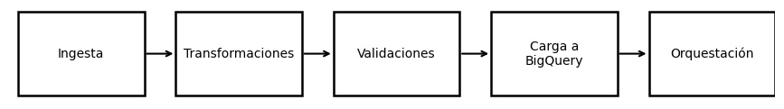

# Unidad Temática 5 – Pipelines ETL

Esta unidad estuvo enfocada en el diseño e implementación de **pipelines ETL/ELT modernos**, aplicados directamente sobre Google Cloud.  
El foco estuvo en entender los flujos como procesos automatizados, reproducibles y escalables, integrando conceptos de DataOps y orquestación en la nube.

## Prácticas realizadas

- [**Datos en movimiento: creando un pipeline ETL en Google Cloud**](./practica15/main15.md)

*Implementación de un pipeline completo utilizando Cloud Storage, Cloud Functions y BigQuery, con ejecución basada en eventos.*

- [**DataPrep: limpieza visual de datos orientada a pipeline**](./practica16/main16.md)

*Construcción de un flujo de calidad de datos con Dataprep, usando reglas reproducibles y ejecución automatizada.*

## Reflexión de la unidad

- UT5 permitió pasar del análisis aislado a pensar **procesos continuos**, donde el dato ingresa, se transforma y se publica sin intervención manual.  
- El trabajo en Google Cloud mostró cómo se integran almacenamiento, funciones serverless y bases analíticas para lograr **pipelines reales de producción**.  
- La combinación entre pipelines codificados (Cloud Functions) y pipelines visuales (Dataprep) mostró dos enfoques válidos para equipos modernos.  

En conjunto, la UT5 consolidó la capacidad de **diseñar flujos de datos robustos, automatizados y mantenibles**, conectando todos los aprendizajes previos hacia una visión más completa de la ingeniería de datos en la nube.

## Flujo de trabajo de UT5

Este flujo describe el pipeline desarrollado en la UT5: ingesta automatizada, transformaciones, validaciones, carga en BigQuery y orquestación en la nube.

## Conclusión final de UT5

La UT5 marcó un cierre fuerte del curso, mostrando que los datos no solo se analizan: **se orquestan**.  
Los pipelines ETL/ELT en la nube permiten escalar, automatizar y versionar el flujo completo, preparando el terreno para proyectos reales de analítica y machine learning.

- - - 

📓 [Índice del portafolio](../portfolio/index.md)
