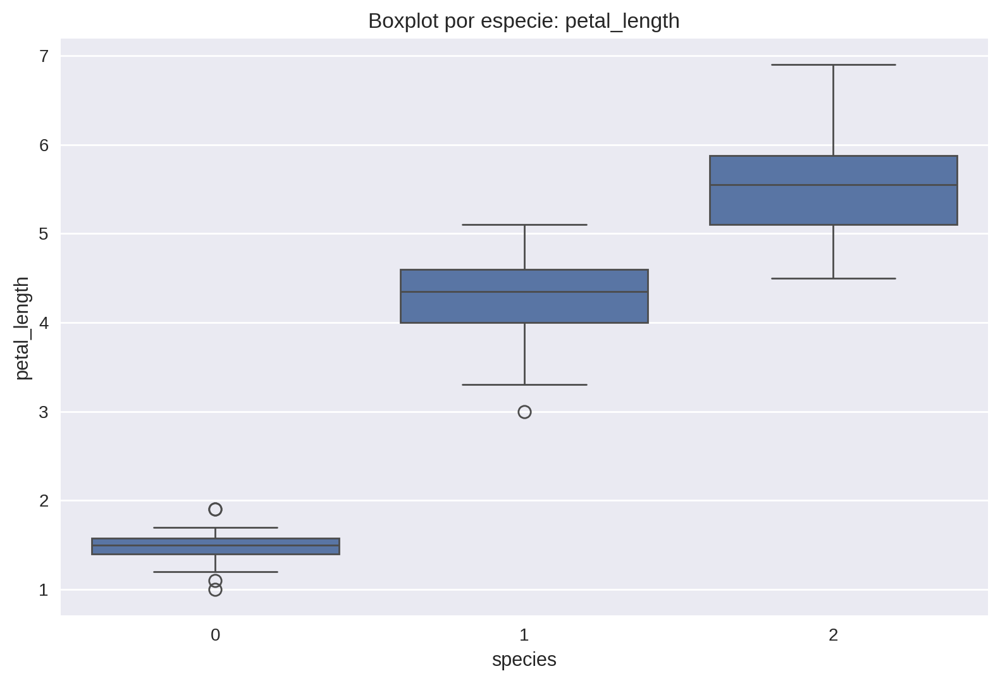

# UT1 · Práctica 1 — Exploración del dataset Iris

## Contexto
El dataset **Iris** es un clásico de la ciencia de datos y el aprendizaje automático.  
Incluye 150 registros con medidas de sépalos y pétalos de tres especies (*Setosa*, *Versicolor*, *Virginica*).  
Su simplicidad y limpieza lo convierten en un punto de partida ideal para aplicar técnicas de análisis exploratorio (EDA).

---

## Objetivos
- Conocer la estructura y balance del dataset.  
- Generar estadísticas descriptivas y visualizaciones.  
- Identificar correlaciones y variables clave para clasificación.  

---

## Actividades
- Revisión inicial del dataset (dimensiones, tipos de datos).  
- Estadísticas descriptivas (`describe()`).  
- Generación de visualizaciones (pairplot, heatmap, boxplots).  
- Identificación de hallazgos clave.  

---

## Desarrollo
Los datos se cargaron mediante la **subida manual de un CSV a Colab** (`Iris.csv`).  
También documenté alternativas de carga para asegurar reproducibilidad:  
- Seaborn (`sns.load_dataset("iris")`)  
- Scikit-learn (`load_iris(as_frame=True)`)  
- URL pública (`pd.read_csv(...)`)  
- Kaggle API  
- Subida manual en Colab (`files.upload()`)

### Diccionario de datos
| Variable       | Tipo    | Descripción                                        |
|----------------|---------|----------------------------------------------------|
| sepal_length   | float   | Longitud del sépalo (cm)                           |
| sepal_width    | float   | Ancho del sépalo (cm)                              |
| petal_length   | float   | Longitud del pétalo (cm)                           |
| petal_width    | float   | Ancho del pétalo (cm)                              |
| species        | string  | Especie de la flor (*Setosa*, *Versicolor*, *Virginica*) |

---
### Evidencias

Referencias:
- especie 0 : Setosa
- especie 1 : Versicolor
- especie 2 : Virginica 

## Heatmap

*El heatmap confirma una correlación muy fuerte entre el largo y el ancho de los pétalos.* 

### Pairplot

*El gráfico muestra cómo Setosa se separa claramente de las demás especies, mientras que Versicolor y Virginica presentan mayor solapamiento.*

### Boxplot

*El boxplot refleja que Setosa tiene pétalos más pequeños, mientras que Virginica concentra los valores más altos.*

---
## Insights clave
1. **Setosa** se diferencia netamente de las otras dos especies en las medidas de pétalos.  
2. Existe una **correlación de ~0.96** entre largo y ancho de pétalos.  
3. El dataset está **balanceado**: 50 registros por cada especie.  
4. *Versicolor* y *Virginica* muestran **zonas de solapamiento** que podrían dificultar la clasificación.  
5. Las variables de pétalos son más **discriminatorias** que las de sépalos.  

---

## Reflexión
Esta práctica permitió aplicar un flujo completo de análisis exploratorio: cargar datos, describirlos, visualizarlos y extraer insights.  
Los resultados muestran la importancia de identificar variables discriminantes antes de aplicar algoritmos de clasificación.  

Además, pude ver cómo distintas librerías ofrecen formas de cargar el dataset, lo cual es fundamental para asegurar reproducibilidad en futuros proyectos.  

---

## Referencias
- [Iris Dataset (UCI)](https://archive.ics.uci.edu/dataset/53/iris)  
- [Iris Dataset (Kaggle)](https://www.kaggle.com/datasets/uciml/iris)  
- [Consigna oficial](https://juanfkurucz.com/ucu-id/ut1/01-exploracion-iris/)
---
## Navegación
- [Volver al índice general](../index.md)
- [Ir al portafolio completo](index.md)
- [Ir a la Práctica 2](ut1-practica2.md)

---
## Nota
El código completo y reproducible de esta práctica está disponible en el README de la carpeta correspondiente en GitHub.
