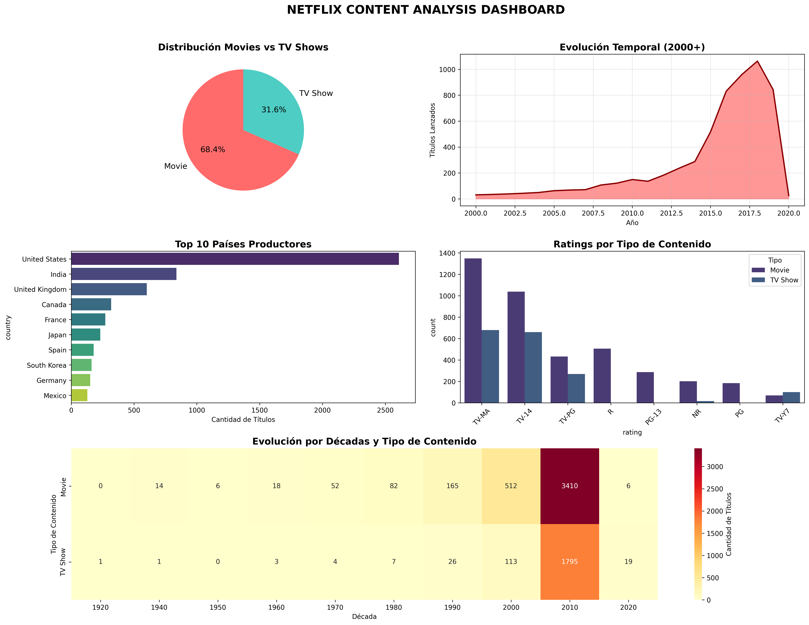

# UT1 · Práctica 2 — Exploración del dataset Netflix

## Contexto
El dataset de Netflix contiene información sobre más de 6.000 títulos entre películas y series, con variables como tipo de contenido, país, director, elenco, año de lanzamiento, fecha de incorporación, duración, clasificación y géneros.  
Este conjunto de datos es ampliamente utilizado para prácticas de análisis exploratorio de datos (EDA).

---

## Objetivos
- Explorar la estructura y calidad del dataset.  
- Identificar valores faltantes y patrones de datos incompletos.  
- Analizar tendencias en lanzamientos y distribución de contenido.  
- Visualizar características clave mediante gráficos y un dashboard final.  

---

## Actividades
- Carga y exploración inicial del dataset (`shape`, `head`, `info`, `describe`).  
- Análisis de valores faltantes y creación de visualizaciones específicas.  
- Generación de gráficos descriptivos:  
  - Distribución de Movies vs TV Shows.  
  - Evolución temporal de títulos lanzados.  
  - Ratings por tipo de contenido.  
  - Principales países productores.  
- Creación de un **dashboard integrado** que sintetiza los hallazgos.  

---

## Desarrollo
Los datos se cargaron desde un archivo CSV (`netflix_titles.csv`) subido a Google Colab.  
Se realizó una limpieza básica y se generaron visualizaciones para explorar la distribución del contenido en Netflix.  
La práctica incluyó la identificación de variables con mayor proporción de datos faltantes (`director`, `cast`, `country`), así como un análisis temporal que mostró el crecimiento acelerado en los lanzamientos después del 2010.  

---

## Evidencias
A continuación, se presenta el dashboard final con los principales resultados del análisis:

---

## Insights clave
1. El 68% del contenido corresponde a **películas**, frente al 32% de series.  
2. La mayor cantidad de títulos proviene de **Estados Unidos e India**.  
3. El crecimiento en lanzamientos se intensifica después de **2010**, alcanzando un pico en 2018.  
4. Los ratings más frecuentes son **TV-MA** y **TV-14**.  
5. Existen variables con gran proporción de datos faltantes, especialmente **director** y **cast**.  

---

## Reflexión
Esta práctica permitió aplicar un flujo completo de análisis exploratorio, desde la carga y limpieza de datos hasta la generación de visualizaciones individuales y un dashboard final integrador.  
El caso de Netflix muestra la importancia de detectar patrones de calidad de datos y de sintetizar la información en gráficos claros y reproducibles.

---

## Referencias
- [Dataset en Kaggle](https://www.kaggle.com/datasets/shivamb/netflix-shows)    

---

## Navegación
- [Volver al índice general](../index.md)  
- [Ir al portafolio completo](../portfolio/index.md)  
- [Ir a la Práctica 3](ut1-practica3.md)  